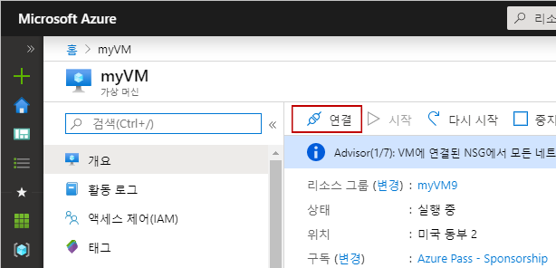
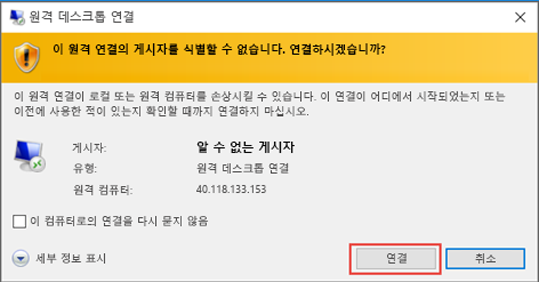
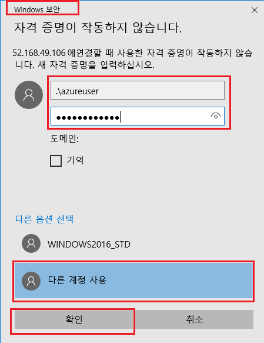
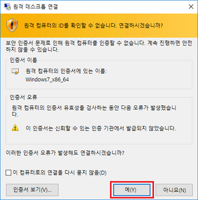
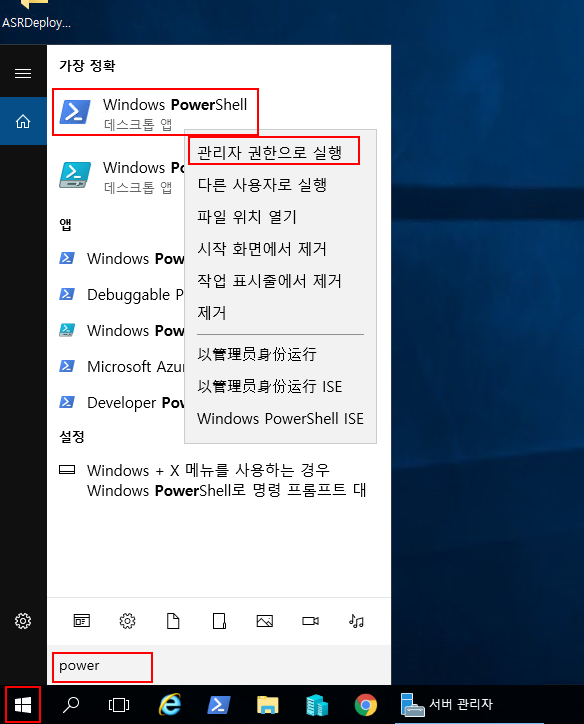
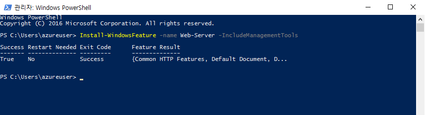
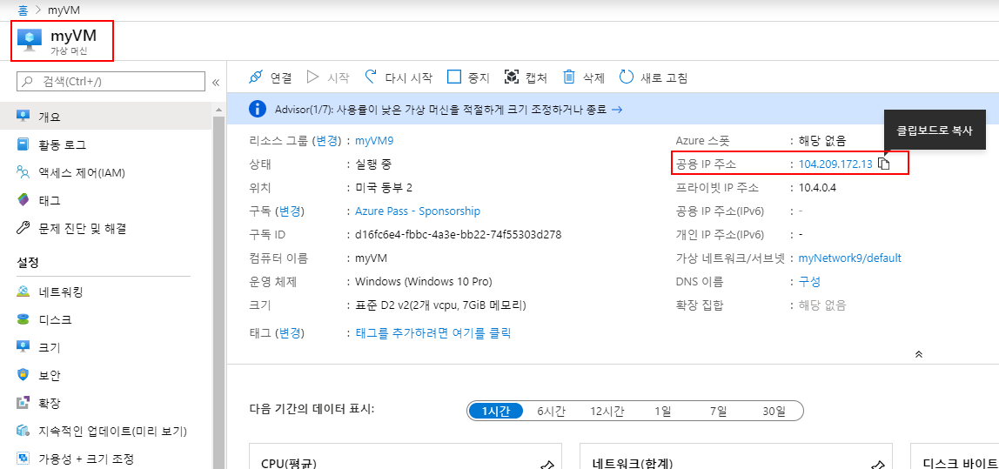
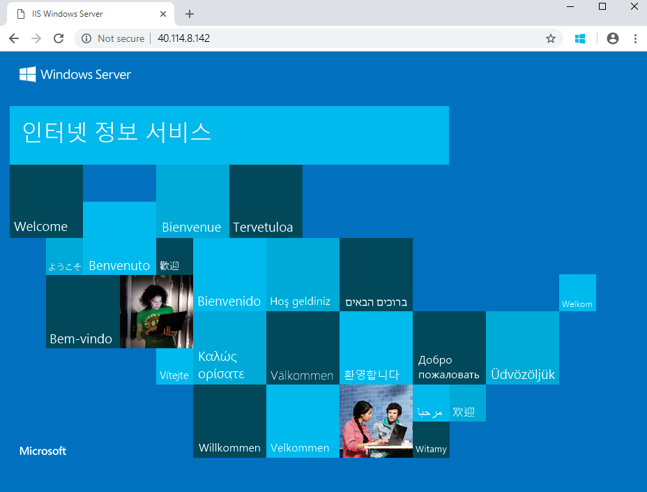

---
wts:
    title: '01 - 포털에서 가상 머신 만들기'
    module: '모듈 02 - Azure 핵심 서비스'
---
# 01 - 포털에서 가상 머신 만들기

이 장에서는 Azure Portal에서 가상 머신을 생성하고 이 가상 머신에 웹 서버를 설치하고 테스트합니다. 

예상 시간: 45분

**참고**: 이 연습을 수행하는 동안 정보 아이콘을 클릭하고 내용을 참고하십시요. 

# 첫번째 작업: Azure 가상 머신 만들기

이 작업에서는 Windows Server 2016 Datacenter 가상 머신을 만듭니다. 

1. [Azure Portal](https://portal.azure.com) 에 로그인합니다.

2. **가상 머신** 을 검색하고 **+추가** 를 클릭합니다.

3. **기본** 탭에서 정보를 입력합니다. 다른 항목은 기본값을 사용합니다.

	|설정 | 값 |
	|---|---|
	|구독 | **구독 중 선택**|
	|리소스 그룹 | **myRGVM**(새로 만들기) |
	|가상 머신 이름 | **myVm** |
	|위치 | **(미국) 미국 동부**|
	|이미지 | **Windows Server 2016 Datacenter**|
	|관리자 계정 사용자 이름 | **azureuser** |
	|관리자 계정 암호 | **Pa$$w0rd1234**|
	|인바운드 포트 규칙 - 포트 선택 허용 | **RDP(3389)** 및 **HTTP(80)**|
	|||

4. 관리 탭 및 **모니터링** 섹션으로 이동합니다.

	| 설정 | 값 |
	|---|---|
	|부팅 진단 | **꺼짐**|
	|||

5. 나머지 기본값은 그대로 유지하고 다음 페이지 하단에 있는 **검토 + 생성** 단추를 선택합니다.

6. 유효성 검사가 완료되면 **생성** 단추를 클릭합니다. 가상 머신을 생성하는 과정은 약 5~7분이 소요 될 수 있습니다.

7. 배포 페이지와 **알림** 아이콘(상단 메뉴)을 통해 업데이트가 제공됩니다.

# 두번째 작업: 가상 머신에 접속

이 작업에서는 상기 생성 된 가상 머신에 RDP(원격 PC 접속)을 통해 접속합니다. 

1. 검색 창에 **myVM** 을 입력하고 '새로운 가상 머신'을 선택합니다.

**참고**: **알림** 에서 **리소스로 이동** 링크를 사용할 수도 있습니다. 

2. 가상 머신의 **개요** 페이지에서 **접속** 단추를 클릭합니다.

    

    **참고**: 다음 기술문서는 Windows 사용자가 VM에 연결하는 방법을 알려줍니다. iOS 사용자 및 Linux 사용자는 Apple 앱 스토어 및 `ssh` 명령어를 통해 얻어진 bash와 같은 RDP 클라이언트가 필요합니다.

2. **가상 머신에 연결** 페이지에서 3389번 포트를 통해 공용 IP 주소에 연결하는 기본 옵션을 유지한 채, **RDP 파일 다운로드** 를 클릭합니다.

3. 다운로드된 RDP 파일을 **열기** 한 후, 메시지가 표시되면 **연결** 을 클릭합니다. 

    

4. **윈도우 보안** 창에서 **다른 옵션 선택** 을 클릭하고 **다른 계정 사용** 을 선택합니다. 사용자 이름(.\azureuser)과 암호(Pa$$w0rd1234)를 입력합니다. **확인** 을 클릭하여 접속합니다.

    


5. 로그인 과정 중 인증서 경고가 표시될 수 있습니다. **예** 를 클릭하여 접속이 허용 된 가상머신에 접속합니다. 성공적으로 연결이 되었는지 확인합니다.

    

축하합니다! Azure에서 윈도우 서버의 가상 머신을 성공적으로 배포하고 접속을 확인하였습니다.

# 세번째 작업: 웹 서버 기능 설치 및 확인

이 작업에서는 웹 서버 기능을 설치하고 기본 IIS 시작 페이지가 정상적으로 표시되는 지 확인합니다.

1. 가상 머신에서 PowerShell 명령 프롬프트를 엽니다. **시작** 단추를 클릭하고 **PowerShell** 을 입력하고 다음 메뉴에서 **Windows PowerShell** 을 마우스 우클릭하여 **관리자로 실행** 을 선택하면 됩니다.

    

2. PowerShell 명령 프롬프트에서 다음 명령을 실행하여 가상 머신에 **Web-Server** 기능을 설치합니다. 이 명령은 복사 및 붙여넣기 할 수 있습니다.

```PowerShell
Install-WindowsFeature -name Web-Server -IncludeManagementTools
```
  
3. 명령을 완료하면 **Success** 메시지와 **True** 값이 표시됩니다. 설치를 완료하기 위해 가상 머신을 다시 시작하지 않아도 됩니다. VM에 대한 RDP 연결을 닫습니다.

    

4. 포털로 돌아온 후 VM의 **개요** 창에서 VM을 선택하고 공용 IP 주소의 오른쪽에 있는 **복사하려면 클릭** 단추를 사용하여 복사하고 브라우저 탭에 붙여 넣습니다.

    

5. 기본 IIS 웹 서버 시작 페이지가 열리며 이 IP 주소를 통해 또는 정규화된 도메인 이름을 통해 공개적으로 연결할 수 있습니다.

    

축하합니다! 이 IP 주소를 통해 또는 정규화된 도메인 이름을 통해 공개적으로 연결할 수 있는 웹 서버를 만들었습니다. 호스트할 웹 페이지가 있는 경우 해당 원본 파일을 가상 시스템에 배포하고 배포된 가상 컴퓨터에서 공용 액세스를 위해 호스트할 수 있습니다.


**참고**: 추가 비용을 방지하려면 이 리소스 그룹을 제거할 수 있습니다. 리소스 그룹을 검색하고 리소스 그룹을 클릭한 다음 **리소스 그룹 삭제** 를 클릭합니다. 리소스 그룹의 이름을 확인한 다음 **삭제** 를 클릭합니다. **알림** 을 모니터링하여 삭제가 어떻게 진행되는지 확인합니다.
