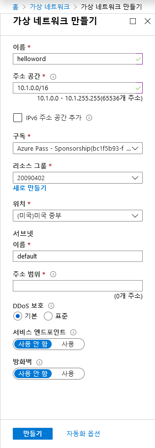
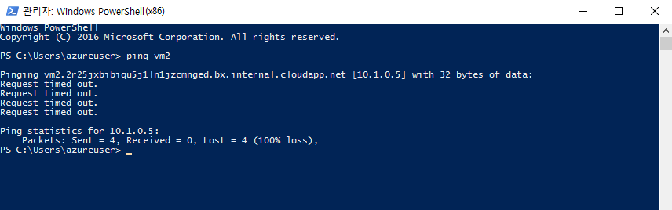

---
wts:
    title: '03 - 가상 네트워크 만들기'
    module: '모듈 02 - 핵심 Azure 서비스'
---
# 03 - 가상 네트워크 만들기

이 연습에서는 가상 네트워크를 만들고 두 대의 가상 머신을 해당 가상 네트워크에 배포한 다음 한 가상 머신에서 해당 가상 네트워크를 통해 다른 가상 머신에  ping을 요청합니다.

예상 시간: 45분

# 작업 1: 가상 네트워크 만들기

이 작업에서는 새 가상 네트워크를 만듭니다. 

1. Azure Portal에 로그인합니다. <a href="https://portal.azure.com" target="_blank"><span style="color: #0066cc;" color="#0066cc">https://portal.azure.com</span></a>

2. **가상 네트워크** 를 검색하고 **+추가** 를 클릭합니다. 

3. **가상 네트워크 생성 - 기본** 탭에서 다음을 입력합니다.

    | 설정 | 값 | 
    | --- | --- |
    | 구독 | **구독 중 선택** |
    | 리소스 그룹 | **myRGVNet**(새로 만들기) |
    | 이름 | **vnet1** |
    | 지역 | **미국 동부** |
    | | |

4. **IP 주소** 탭으로 이동합니다. 기본값을 사용합니다. 변경해야 하는 경우 IP 주소 공간 삭제 아이콘을 사용합니다. 

    | 설정 | 값 | 
    | --- | --- |
    | 주소 공간 |**10.1.0.0/16** |
    | 서브넷 - 이름 | **default** |
    | 서브넷 주소 범위 | **10.1.0.0/24** |
    | | |

    

5. **검토 및 생성** 단추를 클릭합니다. 가상 네트워크의 유효성 여부를 확인합니다.

6. **생성** 단추를 클릭하여 가상 네트워크를 배포합니다. 

7. 조직에서 필요한 가상 네트워크와 IP 주소 지정을 확인하려면 어떻게 해야 할까요?

# 작업 2: 가상 머신 2개 만들기

이 작업에서는 가상 네트워크에 두 대의 가상 머신을 만듭니다. 

1. **가상 머신** 을 검색하고 **+추가** 를 클릭합니다. 

2. **가상 머신 만들기** - **기본** 탭에서 다음 정보를 입력하거나 선택합니다. 그외 필드에는 기본값을 유지합니다. 

   | 설정 | 값 | 
   | --- | --- |
   | 구독 | **구독 중 선택**  |
   | 리소스 그룹 |  **myRGVNet** |
   | 가상 머신 이름 | **vm1**|
   | 지역 | **(미국) 미국 동부** |
   | 이미지 | 기본 **윈도우 서버 2016**데이터 센터 |
   | 사용자 이름| **azureuser** |
   | 암호| **Pa$$w0rd1234** |
   | 공용 인바운드 포트| **선택한 포트허용** 선택  |
   | 선택한 인바운드 포트| **RDP** |
   |||

3. **네트워킹** 탭을 선택합니다. 가상 머신이 vnet1 가상 네트워크에 있는지 확인합니다. 기본 설정을 검토하되 변경하지는 마십시오. 

   | 설정 | 값 | 
   | --- | --- |
   | 가상 네트워크 | **vnet1** |
   |||

4. **검토 + 생성** 를 선택합니다. 유효성 검사에 통과한 후 **생성** 를 선택합니다. 배포 시간은 다양할 수 있지만 일반적으로 배포하는 데 3~6분이 걸릴 수 있습니다.

5. 배포를 모니터링하면서 다음 단계로 계속합니다. 

6. 위의 **2~4** 단계를 반복하여 두 번째 가상 머신을 만듭니다. 다른 가상 머신 이름을 사용하고 가상 머신이 새 가상 네트워크에 있는지 확인합니다.

    | 설정 | 값 |
    | --- | --- |
    | 리소스 그룹 | **myRGVNet** |
    | 가상 머신 이름 |  **vm2** |
    | 가상 네트워크 | **vnet1** |
    | 공용 IP | **vm2-ip**(새로 만들기) |
    |||

7. **vm2** 만들기가 완료되면 **검토 + 생성** 를 클릭하여 구성 유효성을 검사하고 유효성이 검사되면 **생성** 을 클릭합니다.

8. 가상 머신이 배포될 때까지 기다립니다. 

# 작업 3: 연결 테스트 

이 작업에서는 ICMP 연결을 허용하고 가상 머신이 서로 통신(ping)할 수 있는지 테스트합니다. 

1. **vm1** 을 검색하고 **상태** 가 **실행 중** 인지 확인합니다. 페이지 **새로 고침** 이 필요할 수 있습니다.

2. **개요** 블레이드에서 **연결** 단추를 클릭합니다.

    **참고**: 다음 지침은 Windows 컴퓨터에서 VM에 연결하는 방법을 알려줍니다. 

3. **가상 머신에 연결** 페이지에서 포트 3389를 통해 DNS 이름으로 연결하는 기본 옵션을 유지하고 **RDP 파일 다운로드** 를 클릭합니다.

4. 다운로드된 RDP 파일을 열고 메시지가 표시되면 **연결** 을 클릭합니다. 

5. **Windows 보안** 창에서 **다른 옵션 선택** 을 선택한 다음 **다른 계정 사용** 을 선택합니다. 사용자 이름을 **azureuser** 로 입력합니다. 암호 **Pa$$w0rd1234** 를 입력하고 **확인** 을 클릭합니다.

6. 로그인 프로세스 중에 인증서 경고가 표시될 수 있습니다. **예** 를 클릭하거나 연결을 생성하고 배포된 VM에 연결합니다. 성공적으로 연결해야 합니다.

7. 가상 머신에서 PowerShell 명령 프롬프트를 엽니다. **시작** 단추를 클릭하고 **PowerShell** 을 입력한 다음 메뉴에서 **Windows PowerShell** 을 마우스 오른쪽 단추로 클릭하고 **관리자로 실행** 을 선택하면 됩니다.

7. vm2에 ping을 시도합니다(vm2가 실행 중인지 확인). 요청 시간이 초과되었다는 내용의 오류 메세지가 표시됩니다. `ping` 은 **ICMP(인터넷 제어 메시지 프로토콜)** 를 사용하기 때문에 `ping`이 실패합니다. 기본적으로 ICMP는 Windows 방화벽을 통해 허용되지 않습니다.


```PowerShell
ping vm2
```
   
   

**이제 vm2로 전환하고 ICMP를 허용합니다.**

8. RDP를 사용하여 **vm2** 에 연결합니다. **2~6단계** 를 수행할 수 있습니다.

9. **PowerShell** 프롬프트를 열고 ICMP를 허용합니다. 이 명령은 Windows 방화벽을 통한 ICMP 인바운드를 허용합니다.

```PowerShell
New-NetFirewallRule –DisplayName “Allow ICMPv4-In” –Protocol ICMPv4
```
    

**vm1로 전환하고 ping을 다시 시도**


10. vm1 원격 세션으로 돌아가서 ping을 다시 시도합니다. 이제 성공해야 합니다. 

```PowerShell
ping vm2
```

축하합니다! 가상 네트워크에서 2개의 가상 머신을 구성하고 배포했습니다. 또한 가상 머신 중 하나에서 ping 요청을 허용하도록 방화벽을 구성했습니다. 

**참고**: 추가 비용을 방지하려면 이 리소스 그룹을 제거할 수 있습니다. 리소스 그룹을 검색하고 리소스 그룹을 클릭한 다음 **리소스 그룹 삭제** 를 클릭합니다. 리소스 그룹의 이름을 확인한 다음 **삭제** 를 클릭합니다. **알림** 을 모니터링하여 삭제가 어떻게 진행되는지 확인합니다.
