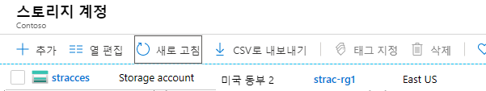
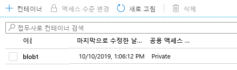
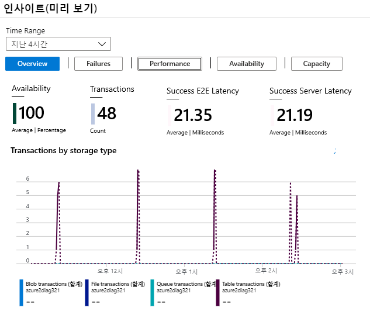

---
wts:
    title: '04 - Blob Storage 만들기'
    module: '모듈 02 - 핵심 Azure 서비스'
---
# 04 - Blob Storage 만들기

이 연습에서는 스토리지 계정을 만든 다음 Blob Storage 파일로 작업합니다.

예상 시간: 25분. 

# 작업 1: 스토리지 계정 만들기

이 작업에서는 새 스토리지 계정을 만듭니다. 

1. Azure Portal에 로그인합니다. <a href="https://portal.azure.com" target="_blank">https://portal.azure.com</a>

2. **스토리지 계정** 을 검색하여 선택하고 **+추가** 를 클릭합니다. 

3. 다음 세부 정보를 사용하여 스토리지 계정 만들기 **기본** 블레이드를 작성합니다.

    | 설정 | 값 | 
    | --- | --- |
    | 구독 | **보유한 구독 선택** |
    | 리소스 그룹 | **myRGStorage**(새로 만들기) |
    | 저장소 계정 이름 | **storageaccountxxx**(고유해야 함) |
    | 위치 | **(미국) 미국 동부**  |
    | 성능 | **표준** |
    | 계정 종류 | **StorageV2(범용 v2)** |
    | 복제 | **로컬 중복 스토리지 (LRS)** |
    | 액세스 계층 (기본값) | **뜨거운** |
    | | |

5. **검토 + 만들기** 를 선택하여 저장소 계정 설정을 검토하고 Azure에서 구성의 유효성을 검사할 수 있도록 허용합니다. 

6. 검증되면 **생성**.을 선택합니다. 계정이 성공적으로 생성되었다는 알림을 기다립니다. 

7. **스토리지 계정** 을 검색하고 새 스토리지 계정이 나열되어 있는지 확인합니다.

    

# 작업 2: Blob Storage 작업

이 작업에서는 Blob 컨테이너를 만들고 Blob 파일을 업로드합니다. 

1. 새 스토리지 계정을 클릭하고 **Blob** 서비스 섹션으로 스크롤한 다음 **컨테이너** 를 선택합니다.

2. **+컨테이너** 를 클릭하고 정보를 작성합니다. 자세한 내용을 보려면 정보 아이콘을 사용합니다. 완료되면 **확인** 을 클릭합니다.

    | 설정 | 값 |
    | --- | --- |
    | 이름 | **blob1**  |
    | 공용 액세스 수준| **개인(익명 액세스 없음)** |
    | | |

    

4. **blob1** 컨테이너를 선택하고 **업로드** 를 클릭합니다.

5. 로컬 컴퓨터의 파일로 이동합니다. 파일이 없는 경우 단순한 '.txt' 파일을 만듭니다. 

6. **고급** 화살표를 클릭한 다음 기본값을 그대로 두고 옵션을 기록한 다음 **업로드** 를 선택합니다.

    **참고**: 이 방법으로 원하는 만큼 Blob을 업로드할 수 있습니다. 새 Blob은 컨테이너 내에 나열됩니다.

7. 파일이 업로드되면 파일을 마우스 오른쪽 단추로 클릭하고 편집/보기, 다운로드, Blob 속성 및 삭제와 같은 옵션을 확인할 수 있습니다. 

8. 시간이 있으면 스토리지 계정으로 돌아가서 파일, 테이블 및 큐에 대한 옵션을 검토합니다.

# 작업 3: 스토리지 계정 모니터링

1. 기본 스토리지 계정 페이지로 돌아갑니다.

2. **진단 및 문제 해결** 을 클릭합니다. 

3. 가장 일반적인 스토리지 문제 중 일부를 살펴봅니다. 문제 해결사가 있습니다.

4. **인사이트(미리 보기)** 를 클릭합니다. 오류, 성능, 가용성 및 용량에 대한 정보가 있습니다. 표시되는 정보는 다를 수 있습니다.

    

축하합니다! 스토리지 계정을 만든 후 Blob Storage 파일로 작업을 수행했습니다.

**참고**: 추가 비용을 방지하려면 이 리소스 그룹을 제거할 수 있습니다. 리소스 그룹을 검색하고 리소스 그룹을 클릭한 다음 **리소스 그룹 삭제** 를 클릭합니다. 리소스 그룹의 이름을 확인한 다음 **삭제** 를 클릭합니다. **알림** 을 모니터링하여 삭제가 어떻게 진행되는지 확인합니다.