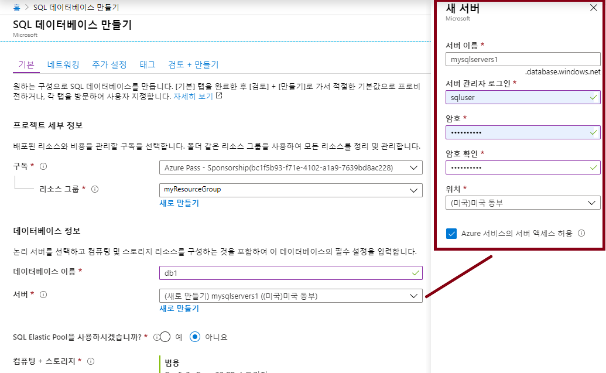
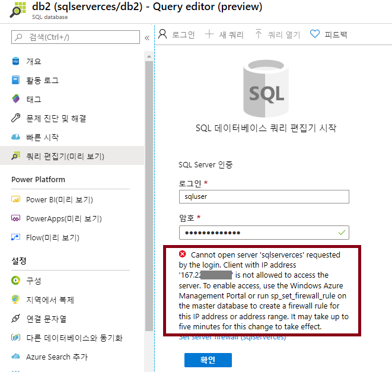
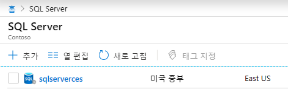
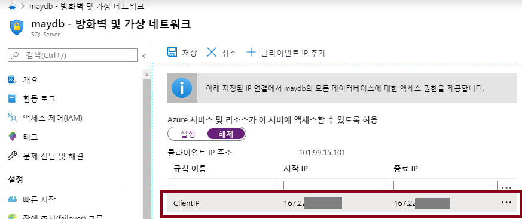
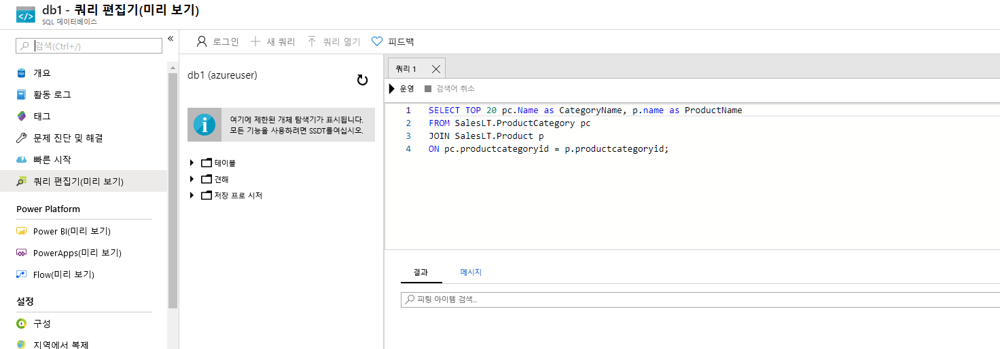
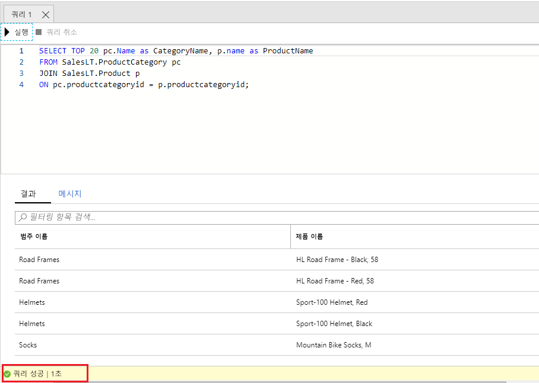

---
wts:
    title: '05 -SQL Database 만들기'
    module: '모듈 02 - 핵심 Azure 서비스'
---

# 05 -SQL Database 만들기

이 연습에서는 Azure에서 SQL Database를 만든 다음 해당 데이터베이스의 데이터를 쿼리합니다.

예상 시간: 25분

# 작업 1: 데이터베이스 만들기

이 작업에서는 AdventureWorksLT 샘플 데이터베이스를 사용하여 새 SQL Database를 만듭니다. 

1. Azure Portal에 로그인합니다. <a href="https://portal.azure.com" target="_blank"><span style="color: #0066cc;" color="#0066cc">https://portal.azure.com</span></a>

2. **SQL Database** 를 검색하여 선택하고 **+추가** 를 클릭합니다. 

3. **기본** 탭에서 다음 정보를 입력합니다.  

    | 설정 | 값 | 
    | --- | --- |
    | 구독 | **보유한 구독 선택** |
    | 리소스 그룹 | **myRGDb**(새로 만들기) |
    | 데이터베이스 이름| **db1** | 
    | | |

3. **서버** 옆에서 **새로 만들기** 를 클릭하고 다음 정보를 입력합니다. 완료되면 **확인** 을 클릭합니다.

    | 설정 | 값 | 
    | --- | --- |
    | 서버 이름 | **sqlserverxxx**(고유해야 함) | 
    | 서버 관리자 로그인 | **sqluser** |
    | 암호 | **Pa$$w0rd1234** |
    | 위치 | **(미국) 미국 동부** |
    | Azure 서비스에서 서버에 액세스할 수 있도록 허용 | **확인란 선택** |
    | | |

   

4. **추가 설정** 탭으로 이동합니다. AdventureWorksLT 샘플 데이터베이스를 사용합니다.

    | 설정 | 값 | 
    | --- | --- |
    | 기존 데이터 사용 | **샘플** | 
    | | |

5. **검토 + 만들기** 를 클릭하고 **만들기** 를 클릭하여 리소스 그룹, 서버 및 데이터베이스를 배포하고 프로비전합니다. 배포하는 데 약 2~5분이 걸릴 수 있습니다.

6. 배포를 모니터링합니다. 

# 작업 2: 데이터베이스 테스트.

이 작업에서는 SQL Server를 구성하고 SQL 쿼리를 실행합니다. 

1. **SQL Database** 를 검색하고 새 데이터베이스가 만들어졌는지 확인합니다. 페이지 **새로 고침** 이 필요할 수 있습니다.

    

2. 만들어진 SQL Database(**db1**)를 열고 **쿼리 편집기(미리 보기)** 를 선택합니다.

3. **sqluser** 와 암호 **Pa$$w0rd1234** 를 사용하여 로그인합니다.

4. 로그인할 수 없습니다. 오류를 자세히 읽고 방화벽을 통해 허용해야 하는 IP 주소를 기록합니다. 

    

5. **SQL Server** 를 검색하고 SQL Server를 선택합니다. 

    

6. SQL Server **개요** 블레이드에서 **방화벽 설정 표시** 를 클릭합니다.

7. **클라이언트 IP 추가**(상단 메뉴 모음)를 클릭하고 오류 페이지의 IP 주소를 추가합니다. 변경 내용을 **저장** 해야 합니다. 

    

8. SQL Database 및 쿼리 편집기(미리 보기) 로그인 페이지로 돌아갑니다. **sqluser** 와 암호 **Pa$$w0rd1234** 를 사용하여 다시 로그인합니다. 이번에는 성공해야 합니다. 새 방화벽 규칙을 배포하는 데 몇 분 정도 걸릴 수 있습니다. 

9. 성공적으로 로그인되고 쿼리 창이 나타나면 다음 쿼리를 편집기 창에 입력합니다.

```SQL
SELECT TOP 20 pc.Name as CategoryName, p.name as ProductName
FROM SalesLT.ProductCategory pc
JOIN SalesLT.Product p
ON pc.productcategoryid = p.productcategoryid;
```

    

4. **실행** 을 선택하고 **결과** 창에서 쿼리 결과를 검토합니다. 쿼리가 성공적으로 실행되어야 합니다.

    

축하합니다! Azure에서 SQL 데이터베이스를 만들고 해당 데이터베이스의 데이터를 성공적으로 쿼리했습니다.

**참고**: 추가 비용을 방지하려면 이 리소스 그룹을 제거할 수 있습니다. 리소스 그룹을 검색하고 리소스 그룹을 클릭한 다음 **리소스 그룹 삭제** 를 클릭합니다. 리소스 그룹의 이름을 확인한 다음 **삭제** 를 클릭합니다. **알림** 을 모니터링하여 삭제가 어떻게 진행되는지 확인합니다.