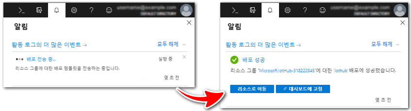
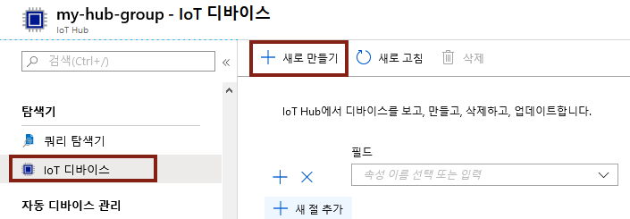
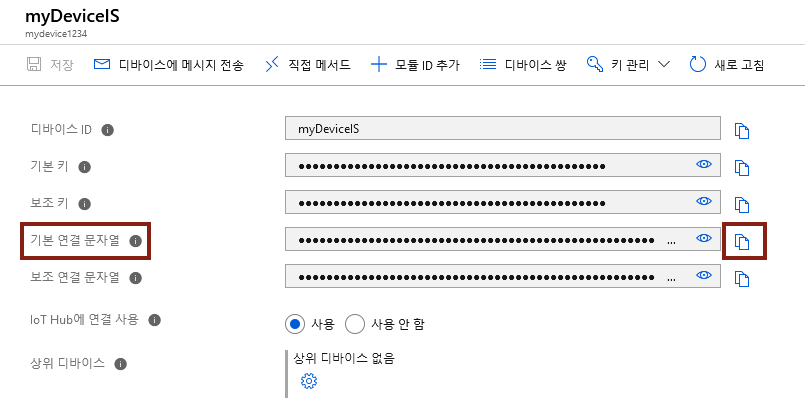
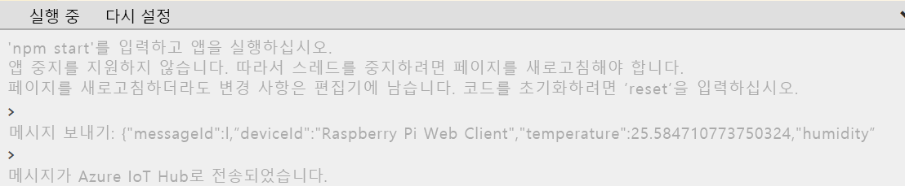
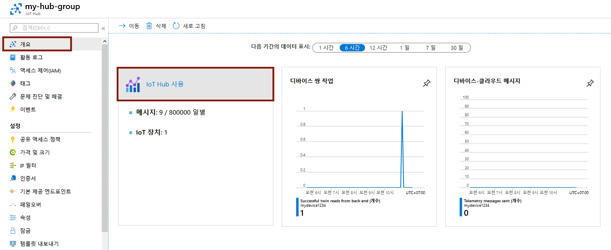

---
wts:
    title: '06 - Azure IoT Hub 구현'
    module: '모듈 02 - 핵심 Azure 서비스'
---
# 06 - Azure IoT Hub 구현

이 연습에서는 Azure Portal에서 새 Azure IoT Hub를 구성하고 온라인 Raspberry Pi 디바이스 시뮬레이터를 사용하여 IoT 디바이스에 대한 연결을 인증합니다. 센서 데이터 및 메시지는 Raspberry Pi 시뮬레이터에서 Azure IoT Hub로 전달되며 Azure Portal에서 메시징 활동에 대한 메트릭을 볼 수 있습니다.

예상 시간: 30분

# 작업 1: IoT Hub 만들기 

이 작업에서는 IoT Hub를 만듭니다. 

1. [Azure Portal](https://portal.azure.com) 에 로그인합니다.

2. **IoT Hub** 를 검색하여 선택하고 **+추가** 를 클릭합니다.

3. 필드를 입력하여 다음 세부 정보를 입력합니다.

	| 설정 | 값 |
	|--|--|
	| 구독 | **구독 중 선택** |
	| 리소스 그룹 |  **myRGIoT**(새로 만들기)|
	| 지역 | **미국 동부** |
	| IoT Hub 이름 | **my-hub-group** |
	| | |	

4. **용량 조절** 탭으로 이동하고 드롭다운 목록을 사용하여 **가격 및 용량 조절 레벨** 을 **F1 - 무료 레벨** 으로 설정합니다. 하루에 사용가능한 메시지의 총량이 표시됩니다. 

5. **검토 + 생성** 단추를 클릭합니다.

6. **생생** 단추를 클릭하여 새 Azure IoT Hub를 생성합니다.

7. 리소스가 배포될 때까지 기다립니다. 

# 작업 2: IoT 장치 추가

이 작업에서는 IoT Hub에 IoT 장치를 추가합니다. 

1. 배포가 완료되면 **알림** 페이지에서 **리소스로 이동** 을 선택합니다. 또는 **IoT Hub** 를 검색하여 새 리소스를 찾을 수 있습니다.

	

2. 새로운 IoT 장치를 추가하려면 **IoT Hub 탐색** 블레이드에서 **탐색기** > **IoT 장치** 를 선택합니다. 그런 다음 **새로 만들기** 단추를 선택합니다.

	

3. 새로운 IoT 장치명(**myRaspberryPi**)을 지정하고 **저장** 단추를 클릭합니다. Azure IoT Hub에 새 IoT 장치 ID가 만들어집니다.

4. 새로운 장치가 표시되지 않으면 IoT 장치 페이지를 **새로 고침** 합니다. 

5. **myRaspberryPi** 를 선택하고 **기본 접속 키** 값을 복사합니다. 다음 작업에서 이 키를 사용하여 Raspberry Pi 시뮬레이터 접속을 인증합니다.

	

# 작업 3: Raspberry Pi 시뮬레이터를 사용하여 디바이스 테스트

이 작업에서는 Raspberry Pi 시뮬레이터를 사용하여 디바이스를 테스트합니다. 

1. 웹 브라우저에서 [온라인 Raspberry Pi 시뮬레이터](https://azure-samples.github.io/raspberry-pi-web-simulator/#Getstarted) 를 엽니다. 

2. Raspberry Pi 시뮬레이터에 대한 정보를 읽습니다. 개요 팝업이 있는 경우 "**X**" 를 선택하여 창을 닫습니다.

3. 코딩 영역의 오른쪽에서 'const connectionString ='가 포함된 줄을 찾습니다. DeviceId를 변경하고 기본 연결 문자열을 사용합니다.

	DeviceId=**myRaspberryPi**

	SharedAccessKey=**기본 연결 문자열**

	

4. **실행**(하단 창)을 선택하여 애플리케이션을 실행합니다. 콘솔 출력에 Raspberry Pi 시뮬레이터가 Azure IoT Hub로 보내는 센서 데이터와 메시지가 표시되어야 합니다. Raspberry Pi 시뮬레이터의 LED는 데이터 및 메시지 전송여부에 따라 깜박이게 됩니다. 

	

5. **중지** 를 선택하여 데이터 전송을 중지합니다.

6. Azure Portal 및 IoT Hub로 돌아갑니다.

7. IoT Hub **개요** 블레이드를 선택하고 **IoT Hub 사용량** 정보로 스크롤합니다.

	

축하합니다! IoT 디바이스에서 센서 데이터를 수집하도록 Azure IoT Hub를 설정했습니다.

**참고**: 추가 비용을 방지하려면 이 리소스 그룹을 제거할 수 있습니다. 리소스 그룹을 검색하고 리소스 그룹을 클릭한 다음 **리소스 그룹 삭제** 를 클릭합니다. 리소스 그룹의 이름을 확인한 다음 **삭제** 를 클릭합니다. **알림** 을 모니터링하여 삭제가 어떻게 진행되는지 확인합니다.
