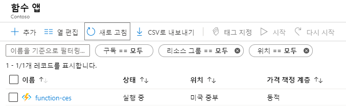
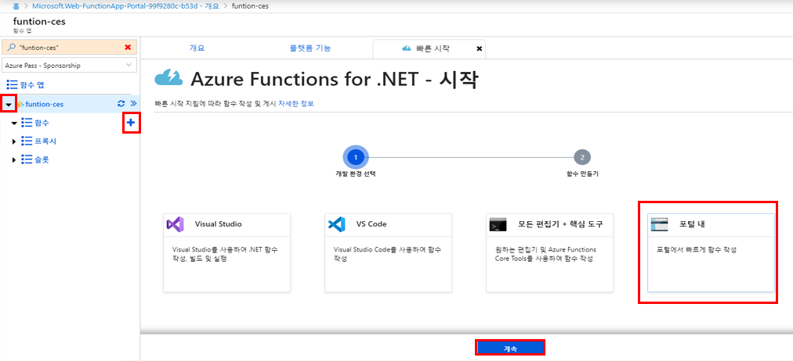
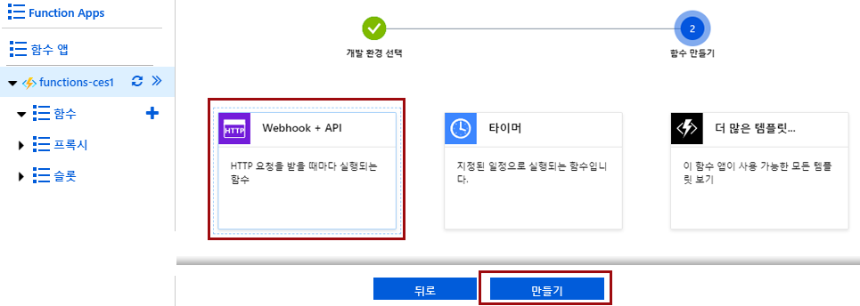
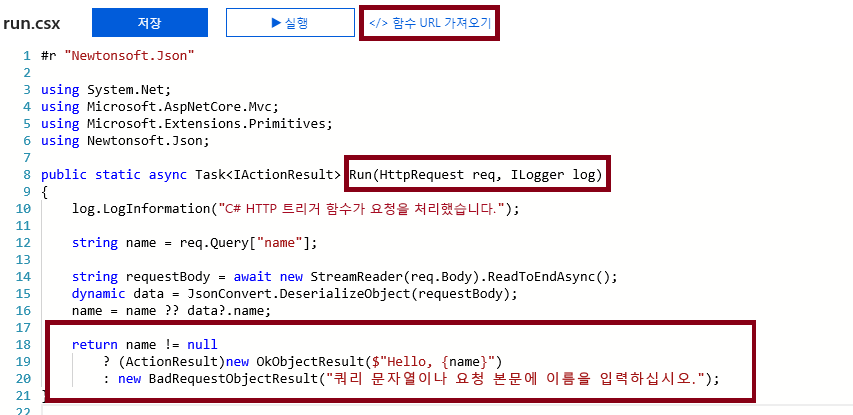
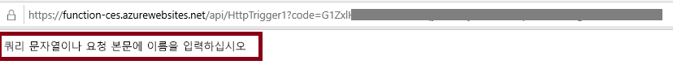
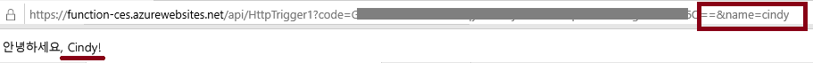
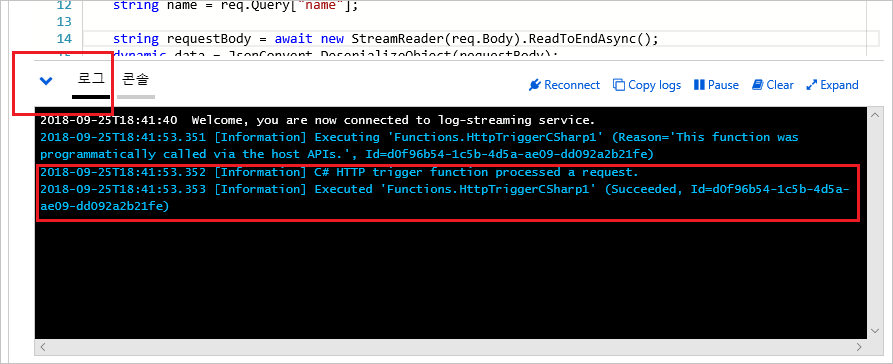

---
wts:
    title: '07 - Azure Functions 구현'
    module: '모듈 02 - 핵심 Azure 서비스'
---
# 07 - Azure Functions 구현

이 연습에서는 HTTP 요청이 수신될 때 Hello 메시지를 표시하는 함수 앱을 만듭니다. 

예상 시간: 30분

# 작업 1: 함수 앱 만들기

이 작업에서는 함수 앱을 만듭니다.

1. [Azure Portal](https://portal.azure.com) 에 로그인합니다.

2. **함수 앱** 을 검색하고 **+추가** 를 클릭합니다.

3. Azure Function 앱 설정 필드를 입력합니다. 지정되지 않은 경우 기본값을 사용합니다. 

    | 설정 | 값 |
    | -- | --|
    | 앱 이름 | **function-xxx**(고유해야 함) |
    | 구독 | **보유한 구독 선택** |
    | 리소스 그룹 | **myRGFunction**(새로 만들기) |
    | OS | **Windows** |
    | 호스팅 계획 | **사용 계획** |
    | 위치 | **미국 동부** |
    | | |	

4. 만들기 **단추** 를 선택하여 새 Azure Functions 앱의 프로비전 및 배포를 시작합니다.

5. 리소스가 생성되었다는 알림을 기다립니다.

6. 함수 앱 페이지를 **새로 고치고** 새 리소스가 *실행 중*인지 확인합니다. 

    

# 작업 2: HTTP 트리거 함수 만들기 및 테스트

이 작업에서는 HTTP 요청이 수신될 때 웹후크 및 API 함수를 사용하여 메시지를 표시합니다. 

1. 새 함수 앱을 선택합니다.

2. **함수** 옆의 "**+**" 단추를 선택하고 **포털 내** 를 선택합니다. Visual Studio 및 VS Code에서의 개발에 대한 다른 선택 사항을 확인합니다. **계속** 을 클릭합니다. 

    

3. **웹후크 + API** 를 선택한 다음 **만들기** 를 선택합니다. 앱에 HTTP 요청이 수신될 때마다 함수가 실행됩니다. 선택할 수 있는 다른 템플릿이 많이 있습니다.

    

4. 이 코드는 HTTP 요청을 실행하고 정보를 기록하도록 설계되었습니다. 또한 이 함수는 이름과 함께 Hello 메시지를 반환합니다. 

    

5. 함수 편집기 상단에서 **함수 URL 가져오기** 를 선택합니다. 

6. **키** 드롭다운 값을 **기본값(함수 키)** 으로 설정합니다. 그런 다음 **복사** 를 선택하여 함수 URL을 복사합니다. 

    

7. 복사된 함수 URL을 웹 브라우저의 주소 표시줄에 붙여 넣습니다. 페이지가 요청되면 함수가 실행됩니다. 함수에 이름이 필요하다는 내용의 메시지가 표시됩니다. 

    

8. URL 끝에 **&name=yourname** 을 추가합니다. 

    **참고**: 여기서 `<yourname>` 은 사용자의 이름을 나타냅니다. 최종 URL은 다음과 유사합니다. `https://azfuncxxx.azurewebsites.net/api/HttpTrigger1?code=X9xx9999xXXXXX9x9xxxXX==&name=cindy`

    

9. 함수가 실행되면 추적 정보가 Azure의 로그 파일에 기록됩니다. Azure Portal에서 로그를 보려면 함수 편집기로 돌아가고 **로그** 단추를 선택합니다.

    

축하합니다! HTTP 요청이 수신될 때 Hello 메시지를 표시하는 함수 앱을 만들었습니다. 

**참고**: 추가 비용을 방지하려면 이 리소스 그룹을 제거할 수 있습니다. 리소스 그룹을 검색하고 리소스 그룹을 클릭한 다음 **리소스 그룹 삭제** 를 클릭합니다. 리소스 그룹의 이름을 확인한 다음 **삭제** 를 클릭합니다. **알림** 을 모니터링하여 삭제가 어떻게 진행되는지 확인합니다.