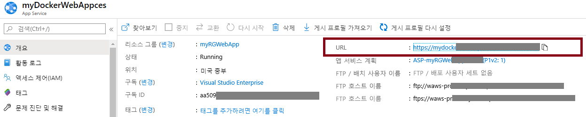
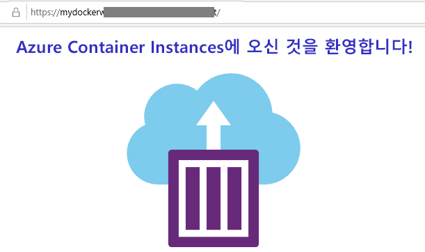

---
wts:
    title: '08 - 웹앱 만들기'
    module: '모듈 02 - 핵심 Azure 서비스'
---
# 08 - 웹앱 만들기

이 연습에서는 Docker 컨테이너를 실행하는 새 웹앱을 만듭니다. 이 컨테이너는 시작 메시지를 표시합니다. 

예상 시간: 25분. 

# 작업 1: 웹앱 만들기

Azure App Service는 웹 애플리케이션의 호스팅 및 실행을 지원하도록 설계된 4가지 서비스의 모음입니다. 4가지 서비스(웹앱, Mobile Apps, API Apps 및 Logic Apps)는 모습은 다르지만 모두 매우 유사한 방식으로 작동합니다. 웹앱은 4가지 서비스 중 가장 일반적으로 사용되는 서비스이며 이 랩에서 사용할 서비스입니다.

이 작업에서는 Azure App Service 웹앱을 만듭니다. 

1. [Azure Portal](http://portal.azure.com/) 에 로그인합니다. 

2. **App Services** 를 검색하고 선택합니다.

3. **+추가** 를 클릭하고 웹앱을 구성합니다. App Service 계획에는 기본값을 사용합니다. 

    | 설정 | 값 |
    | -- | -- |
    | 구독 | **보유한 구독 선택** |
    | 리소스 그룹 | **myRGWebApp1**(새로 만들기) |
    | 이름 | **myDockerWebAppxxx**(고유해야 함) |
    | 게시 | **Docker 컨테이너** |
    | 운영 체제 | **Linux** |
    | 지역 | **미국 동부**(서비스 계획 가용성 경고 무시) |
    | | |	

4. **다음 > Docker** 를 클릭하고 컨테이너 정보를 구성합니다. 시작 명령은 선택 사항이며 이 연습에서는 필요하지 않습니다. 

    **참고:** 이 컨테이너는 Container Instances 연습에서 hello world 메시지를 표시할 때 사용한 것과 동일한 컨테이너입니다. 

    | 설정 | 값 |
    | -- | -- |
    | 옵션 | **단일 컨테이너** |
    | 이미지 소스 | **Docker Hub** |
    | 액세스 유형 | **공용** |
    | 이미지 및 태그 | **microsoft/aci-helloworld** |
    | | |	

5. **검토 + 만들기** 를 클릭하고 **만들기** 를 클릭합니다. 

# 작업 2: 웹앱 테스트

이 작업에서는 웹앱을 테스트합니다.

1. 웹앱이 배포될 때까지 기다립니다.

2. **알림** 에서 **리소스로 이동** 을 클릭합니다. 

3. **속성** 블레이드에서 **URL** 을 찾습니다. 

    

4. **URL** 을 클릭하면 Docker 컨테이너가 실행되고 Azure Container Instances 페이지가 표시됩니다.

    

5. 웹앱의 **개요** 페이지에 여러 차트가 있습니다. URL을 여러 번 실행하면 액세스 정보가 표시됩니다. 여기에는 요청 수와 평균 응답 시간이 포함됩니다. 

**참고**: 추가 비용을 방지하려면 이 리소스 그룹을 제거할 수 있습니다. 리소스 그룹을 검색하고 리소스 그룹을 클릭한 다음 **리소스 그룹 삭제** 를 클릭합니다. 리소스 그룹의 이름을 확인한 다음 **삭제** 를 클릭합니다. **알림** 을 모니터링하여 삭제가 어떻게 진행되는지 확인합니다.

