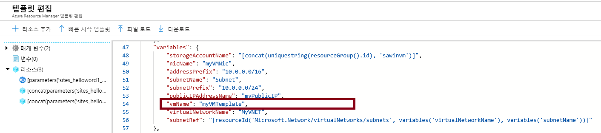
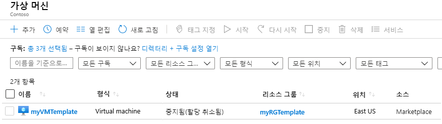
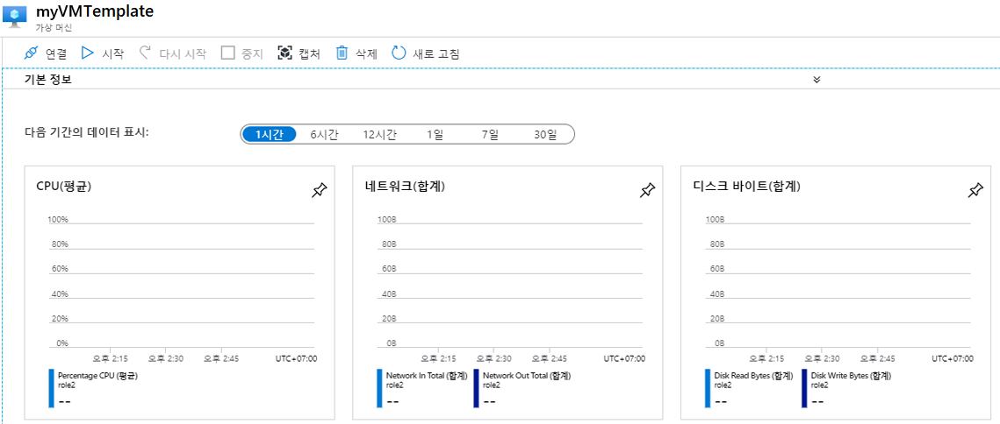
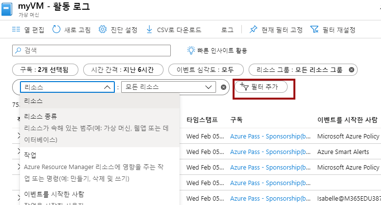

---
wts:
    title: '09 - 템플릿으로 VM 만들기'
    module: '모듈 02 - 핵심 Azure 서비스'
---
# 09 - 템플릿으로 VM 만들기

이 연습에서는 QuickStart 템플릿을 사용하여 가상 머신을 배포하고 모니터링 기능을 검사합니다.

예상 시간: 30분

# 작업 1: 갤러리 탐색 및 템플릿 찾기

이 작업에서는 Azure QuickStart 갤러리를 찾아보고 템플릿을 배포하여 가상 머신을 만듭니다. 

1. 브라우저에서 [Azure Quickstart 템플릿 갤러리](https://azure.microsoft.com/resources/templates?azure-portal=true) 에 액세스합니다. 자주 사용되는 템플릿과 최근에 업데이트된 템플릿 다수가 갤러리에 표시됩니다. 이러한 템플릿은 Azure 리소스와 주요 소프트웨어 패키지 모두에서 작동합니다.

2. 사용 가능한 다양한 유형의 템플릿을 탐색합니다. 적합한 템플릿이 있습니까?

3. [단순한 Windows VM 배포](https://azure.microsoft.com/resources/templates/101-vm-simple-windows?azure-portal=true) 템플릿을 검색하거나 직접 액세스합니다.

    **참고**: **Azure에 배포** 단추를 사용하면 Azure Portal에 직접 템플릿을 배포할 수 있습니다. 이 템플릿에서는 소수의 구성 매개 변수 집합만 구성하면 됩니다. 

4. **Azure에 배포** 단추를 클릭합니다. 

5. **템플릿 편집** 을 클릭합니다. Resource Manager 템플릿 형식은 JSON입니다. 매개 변수를 살펴보고 가상 머신 이름을 찾습니다. 이름을 **myVMTemplate** 로 변경합니다. 변경 내용을 **저장** 합니다.

    

6. 템플릿 매개 변수를 구성합니다. 

	| 설정| 값|
	|----|----|
	| 구독 | **보유한 구독 선택**|
	| 리소스 그룹 | **myRGTemplate**(새로 만들기) |
    	| 관리자 사용자 이름 | **azureuser** |
    	| 관리 암호 | **Pa$$w0rd1234** |
    	| DNS 레이블 접두사 | **myvmtemplatexxx**(고유해야 함) |
    	| Windows OS 버전 | **2016-Datacenter** |
    	| | |

7. **위에 명시된 이용 약관에 동의합니다.** 확인란을 선택하고 **구매** 를 클릭합니다.

    **참고**: 이 템플릿은 무료입니다.

8. 배포를 모니터링합니다. 

# 작업 2: 가상 머신 배포 확인 및 모니터링

이 작업에서는 올바르게 배포된 가상 머신을 확인합니다. 

1. **가상 머신** 을 검색하고 선택합니다.

2. 새 가상 머신이 만들어졌는지 확인합니다. 

    

3. 가상 머신을 선택하고 **개요** 창에서 아래로 스크롤하여 모니터링 데이터를 봅니다.

4. 1시간~30일로 기간을 조정할 수 있습니다.

5. **CPU(평균)**, **네트워크(총계)** 및 **디스크 바이트(총계)** 등 다양한 그래픽이 제공됩니다. 

    

6. 원하는 그래픽을 클릭합니다. **메트릭을 추가** 하면 차트 유형이 변경됩니다. 시간이 있으면 실험해 보십시오. 

7. **개요** 블레이드로 돌아갑니다.

8. **활동 로그**(왼쪽 창)를 클릭합니다. 활동 로그는 리소스가 생성되거나 수정될 때 기록됩니다. 

9. **필터 추가** 를 클릭하고 다양한 이벤트 유형 및 작업을 검색하여 실험합니다. 

    

**참고**: 추가 비용을 방지하려면 이 리소스 그룹을 제거할 수 있습니다. 리소스 그룹을 검색하고 리소스 그룹을 클릭한 다음 **리소스 그룹 삭제** 를 클릭합니다. 리소스 그룹의 이름을 확인한 다음 **삭제** 를 클릭합니다. **알림** 을 모니터링하여 삭제가 어떻게 진행되는지 확인합니다.