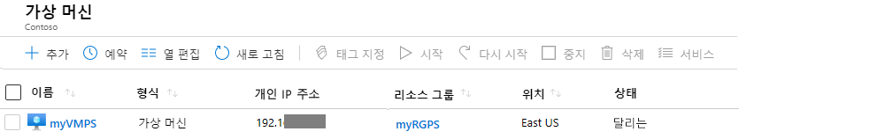
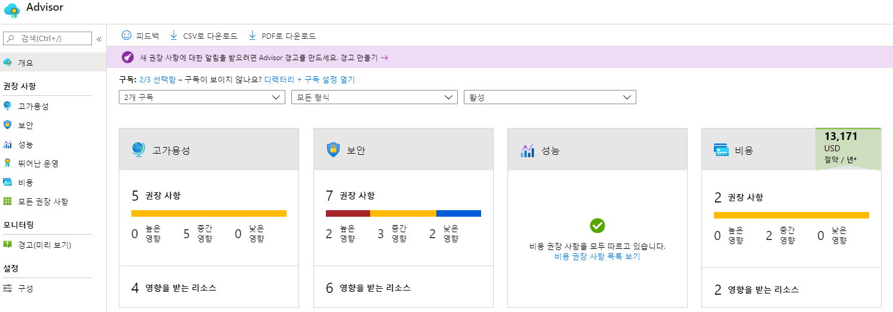
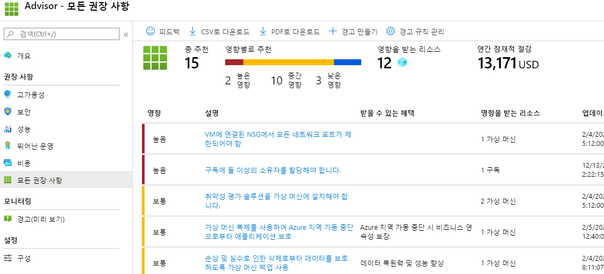

---
wts:
    title: '10 - PowerShell로 VM 만들기'
    module: '모듈 02 - 핵심 Azure 서비스'
---
# 10 - PowerShell로 VM 만들기

이 연습에서는 PowerShell을 로컬로 설치하고, 리소스 그룹 및 가상 머신을 만들며, Cloud Shell에 액세스하여 사용하고, Azure Advisor 권장 사항을 검토합니다. 

예상 시간: 35분

# 작업 1: 로컬로 PowerShell 구성

이 작업에서는 로컬 머신에서 실행할 PowerShell을 구성합니다. 

1. 로컬 머신의 작업 표시줄에서 **시작** 아이콘을 선택합니다. **PowerShell** 을 입력하고 **Windows PowerShell 앱** 을 찾습니다. 앱을 마우스 오른쪽 단추로 클릭하고 **관리자로 실행** 을 선택합니다. 메시지가 표시되면 **예** 를 선택하여 앱을 신뢰합니다. 

    **참고:** Linux 및 macOS의 경우 다음 명령을 사용하여 상승된 권한으로 PowerShell 코어를 시작합니다.

```bash
sudo pwsh
```

2. PowerShell 프롬프트에서 Azure PowerShell 모듈을 설치합니다. 메시지가 표시되면 **모두 예** 를 선택하여 리포지토리를 신뢰합니다. 설치를 완료하는 데 몇 분 정도 걸릴 수 있습니다.

```PowerShell
Install-Module Az -AllowClobber
```

    **참고**: 메시지가 표시될 때 Windows 사용자는 *NuGet* 공급자를 설치하는 데 동의하고 *PowerShell 갤러리*(PSGallery)의 모듈을 설치하는 데 동의해야 합니다. 스크립트 실행이 실패하면 상승된 PowerShell 세션에서 `Set-ExecutionPolicy RemoteSigned` 를 실행합니다. 

3. 최신 Az 모듈 업데이트를 가져옵니다. 

```PowerShell
Update-Module -Name Az
```

    **참고:** 메시지가 표시되면 **모두 예** 를 선택하여 AZ 모듈 업데이트를 신뢰합니다. Az 모듈의 최신 버전이 이미 설치되어 있으면 프롬프트가 자동으로 반환됩니다.

# 작업 2: 리소스 그룹 및 가상 머신 만들기

이 작업에서는 PowerShell을 사용하여 리소스 그룹과 가상 머신을 만듭니다.  

1. 로컬 머신에서 Azure에 연결하고 메시지가 표시되면 Azure 로그인 자격 증명을 제공합니다. 반환되는 구독 및 계정 정보를 검토합니다. 

```PowerShell
Connect-AzAccount
```

2. 새 리소스 그룹을 만듭니다. 

```PowerShell
New-AzResourceGroup -Name myRGPS -Location EastUS
```

3. 새 리소스 그룹을 확인합니다. 

```PowerShell
Get-AzResourceGroup | Format-Table
```

4. 가상 머신을 만듭니다. 메시지가 표시되면 새 머신의 이름(**myVMPS**), 사용자 이름(**azureuser**) 및 암호(**Pa$$w0rd1234**)를 입력합니다. 한 줄에 명령을 입력해야 합니다. 또한 한 줄에 모두 있을 때 틱(`) 표시가 없어야 합니다. 

```PowerShell
    New-AzVm `
    -ResourceGroupName "myRGPS" `
    -Name "myVMPS" `
    -Location "East US" `
    -VirtualNetworkName "myVnetPS" `
    -SubnetName "mySubnetPS" `
    -SecurityGroupName "myNSGPS" `
    -PublicIpAddressName "myPublicIpPS" `
```

5. [Azure Portal](https://portal.azure.com) 에 로그인합니다.

6. **가상 머신** 을 검색하고 **myVMPS** 가 실행 중인지 확인합니다. 몇 분 정도 걸릴 수 있습니다.

    

7. 새 가상 머신에 액세스하고 개요 및 네트워킹 설정을 검토하여 정보가 올바르게 배포되었는지 확인합니다. 

8. 로컬 PowerShell 세션을 닫습니다. 

# 작업 3: Cloud Shell에서 명령 실행

이 작업에서는 Cloud Shell에서 PowerShell 명령을 실행하는 연습을 수행합니다. 

1. Azure Portal에서 오른쪽 상단의 아이콘을 클릭하여 **Azure Cloud Shell** 을 엽니다.

    

2. 이전에 Cloud Shell을 사용한 경우 5단계로 건너뜁니다. 

3. **Bash** 또는 **PowerShell** 을 선택하라는 메시지가 표시되면 **PowerShell** 을 선택합니다. 

4. 메시지가 표시되면 **스토리지 만들기** 를 선택하고 Azure Cloud Shell의 초기화를 허용합니다. 

5. 왼쪽 위 드롭다운 메뉴에서 **PowerShell** 이 선택되어 있는지 확인합니다.

6. 이름, 리소스 그룹, 위치 및 상태 등 가상 머신에 대한 정보를 검색합니다. PowerState가 **running** 상태입니다.

```PowerShell
Get-AzVM -name myVMPS -status | Format-Table -autosize
```

7. 가상 머신을 중지합니다. 메시지가 표시되면 작업을 확인(Yes)합니다. 

```PowerShell
Stop-AzVM -ResourceGroupName myRGPS -Name myVMPS
```

8. 가상 머신 상태를 확인합니다. 이제 PowerState는 **deallocated** 여야 합니다. 포털에서 가상 머신 상태를 확인할 수도 있습니다. 

```PowerShell
Get-AzVM -name myVMPS -status | Format-Table -autosize
```

# 작업 4: Azure Advisor 권장 사항 검토

**참고:** 이 작업은 Azure CLI를 사용하여 VM 만들기의 작업과 동일합니다. 

이 작업에서는 가상 머신에 대한 Azure Advisor 권장 사항을 검토합니다. 

1. 포털에서 **Advisor** 를 검색하고 선택합니다. 

2. Advisor에서 **개요** 를 선택합니다. 권장 사항이 고가용성, 보안, 성능 및 비용으로 그룹화되어 있습니다. 

    

3. **모든 권장 사항** 을 선택하고 각 권장 사항 및 제안되는 작업을 검토합니다. 

    **참고:** 권장 사항은 리소스에 따라 다를 수 있습니다. 

    

4. 권장 사항을 CSV 또는 PDF 파일로 다운로드할 수 있습니다. 

5. 경고를 만들 수도 있습니다. 

6. 시간이 있으면 Azure PowerShell을 사용하여 실험을 계속하십시오. 

축하합니다! 로컬 머신에 PowerShell을 설치하고, PowerShell을 사용하여 가상 머신을 만들었으며, PowerShell 명령을 실행하고, Advisor 권장 사항을 검토했습니다.

**참고**: 추가 비용을 방지하려면 이 리소스 그룹을 제거할 수 있습니다. 리소스 그룹을 검색하고 리소스 그룹을 클릭한 다음 **리소스 그룹 삭제** 를 클릭합니다. 리소스 그룹의 이름을 확인한 다음 **삭제** 를 클릭합니다. **알림** 을 모니터링하여 삭제가 어떻게 진행되는지 확인합니다.