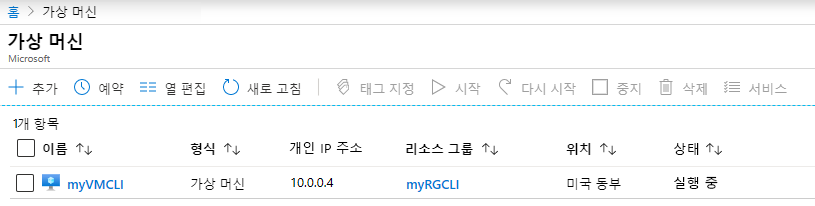
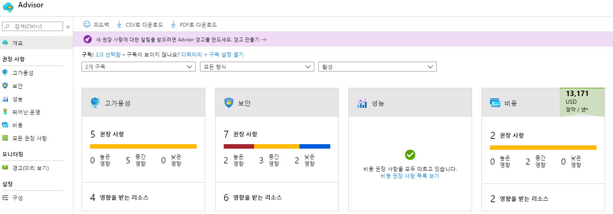
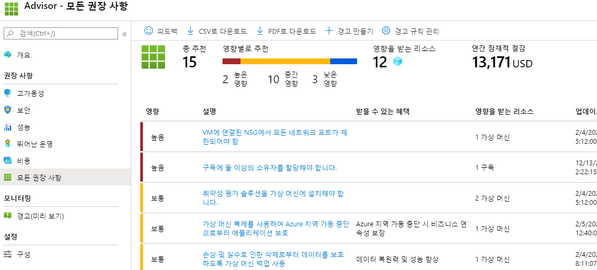

---
wts:
    title: '11 - CLI로 VM 만들기'
    module: '모듈 02 - 핵심 Azure 서비스'
---
# 11 - CLI로 VM 만들기

이 연습에서는 Azure CLI를 로컬로 설치하고, 리소스 그룹 및 가상 머신을 만들며, Cloud Shell을 사용하고, Azure Advisor 권장 사항을 검토합니다. 

예상 시간: 35분

**참고**: 다음 단계는 Windows 설치를 기반으로 하지만 Mac 또는 Linux 환경에도 동일하게 적용될 수 있습니다. 그러나 [각 환경과 관련된 특정 설치 단계](https://docs.microsoft.com/cli/azure/install-azure-cli) 가 있으니 확인하시기 바랍니다.

# 작업 1: 로컬로 CLI 설치

이 작업에서는 로컬 머신에 Azure CLI를 설치합니다. 

1. [Azure CLI msi](https://aka.ms/installazurecliwindows) 를 다운로드하고 브라우저에서 **실행** 을 선택합니다. 파일을 다운로드하는 데 1분 정도 걸립니다.

2. Microsoft Azure CLI 설치 마법사에서 **라이선스 계약의 약관에 동의** 확인란을 클릭하고 **설치** 를 클릭합니다.

3. **사용자 계정 제어** 대화 상자에서 **예** 를 선택하여 앱에서 디바이스를 변경할 수 있음을 표시합니다. 

4. 설치가 완료되면 **마침** 을 선택합니다.

    **참고:** Azure CLI는 Linux 또는 macOS에서 Bash 셸을 열어 실행하거나 Windows의 명령 프롬프트 또는 PowerShell에서 실행할 수 있습니다. 

# 작업 2: 리소스 그룹 및 가상 머신 만들기

1. 로컬 머신에서 **명령 프롬프트** 를 엽니다. **관리자로 실행** 해야 합니다. 메시지가 표시되면 앱이 디바이스를 변경할 수 있음을 확인(Yes)합니다.

    **참고**: Windows 명령 프롬프트 대신 PowerShell 세션에서도 Azure CLI를 실행할 수 있습니다. PowerShell에서 CLI를 실행하면 더 많은 탭 완성 기능을 비롯한 몇 가지 장점이 있습니다.

2. Azure 구독에 로그인합니다. 구독에 연결된 계정을 선택하고 성공적으로 로그인될 때까지 기다립니다. 

```azurecli
az login
```

3. 원하는 경우 [Azure CLI 설명서 페이지](https://docs.microsoft.com/ko-kr/cli/azure/?view=azure-cli-latest) 에 책갈피를 지정합니다.

4. 버전 확인 명령을 실행하고 성공적으로 실행되는지 확인하여 설치를 확인합니다. 최신 업데이트를 확인할 수 없다는 경고 메시지는 무시해도 됩니다. 

```cli
az --version
```

5. 새 리소스 그룹을 만듭니다.

```cli
az group create --name myRGCLI --location EastUS
```

6. 리소스 그룹이 만들어졌는지 확인합니다.

```cli
az group list --output table
```

7. 새 가상 머신을 만듭니다. 이 명령은 모두 한 줄에 있어야 합니다. 또한 한 줄에 모두 있을 때 틱(') 표시가 없어야 합니다. 


```cli
    az vm create `
        --name myVMCLI `
        --resource-group myRGCLI `
        --image UbuntuLTS `
        --location EastUS `
        --admin-username azureuser `
        --admin-password Pa$$w0rd1234
```

    **참고**: 명령을 완료하는 데 2~3분정도 걸립니다. 명령이 완료되면 가상 머신과 머신에 연결된 다양한 리소스(예: 스토리지, 네트워킹 및 보안 리소스)가 만들어집니다. 가상 머신 배포가 완료될 때까지 다음 단계를 계속하지 마십시오. Azure Cloud Shell이 완료된 후에는 닫아도 됩니다.


8. 명령 실행이 완료되면 [Azure Portal](https://portal.azure.com) 에 로그인합니다.

9. **가상 머신** 을 검색하고 **myVMCLI** 가 실행 중인지 확인합니다.

    

10. 로컬 CLI 세션을 닫습니다. 

# 작업 3: Cloud Shell에서 명령 실행

이 작업에서는 Cloud Shell에서 CLI 명령을 실행하는 연습을 수행합니다. 

1. Azure Portal 오른쪽 상단의 *Azure Cloud Shell 아이콘* 을 클릭하여 **Azure Cloud Shell** 을 엽니다.

    

2. 이전에 Cloud Shell을 사용한 경우 5단계로 건너뜁니다. 

3. **Bash** 또는 **PowerShell** 을 선택하라는 메시지가 표시되면 **Bash** 를 선택합니다. 

4. 메시지가 표시되면 **스토리지 만들기** 를 선택하고 Azure Cloud Shell의 초기화를 허용합니다. 

5. 왼쪽 위 드롭다운 메뉴에서 **Bash** 가 선택되어 있는지 확인합니다.

**셸을 사용하는 경우에는 로그인할 필요가 없습니다.**

6. 이름, 리소스 그룹, 위치 및 상태 등 가상 머신에 대한 정보를 검색합니다. PowerState가 **running** 상태입니다.

```cli
az vm show --resource-group myRGCLI --name myVMCLI --show-details --output table 
```

7. 가상 머신을 중지합니다. 가상 머신이 할당 취소되기 전까지는 청구가 계속된다는 메시지가 표시됩니다. 

```cli
az vm stop --resource-group myRGCLI --name myVMCLI
```

8. 가상 머신 상태를 확인합니다. 이제 PowerState는 **stopped** 여야 합니다.

```cli
az vm show --resource-group myRGCLI --name myVMCLI --show-details --output table 
```

# 작업 4: Azure Advisor 권장 사항 검토

이 작업에서는 Azure Advisor 권장 사항을 검토합니다. 

    **참고:** 이전 랩(PowerShell을 사용하여 VM 만들기)을 수행한 경우 이 작업을 이미 완료한 것입니다. 

1. 포털에서 **Advisor** 를 검색하고 선택합니다. 

2. Advisor에서 **개요** 를 선택합니다. 권장 사항이 고가용성, 보안, 성능 및 비용으로 그룹화되어 있습니다. 

    

3. **모든 권장 사항** 을 선택하고 각 권장 사항 및 제안되는 작업을 검토합니다. 

    **참고:** 권장 사항은 리소스에 따라 다를 수 있습니다. 

    

4. 권장 사항을 CSV 또는 PDF 파일로 다운로드할 수 있습니다. 

5. 경고를 만들 수도 있습니다. 

6. 시간이 있으면 Azure CLI를 사용하여 실험을 계속하십시오.

축하합니다! 로컬 머신에 PowerShell을 설치하고, PowerShell을 사용하여 가상 머신을 만들었으며, PowerShell 명령을 실행하고, Advisor 권장 사항을 검토했습니다.

**참고**: 추가 비용을 방지하려면 이 리소스 그룹을 제거할 수 있습니다. 리소스 그룹을 검색하고 리소스 그룹을 클릭한 다음 **리소스 그룹 삭제** 를 클릭합니다. 리소스 그룹의 이름을 확인한 다음 **삭제** 를 클릭합니다. **알림** 을 모니터링하여 삭제가 어떻게 진행되는지 확인합니다.

