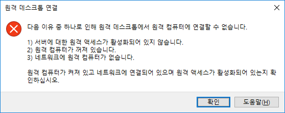
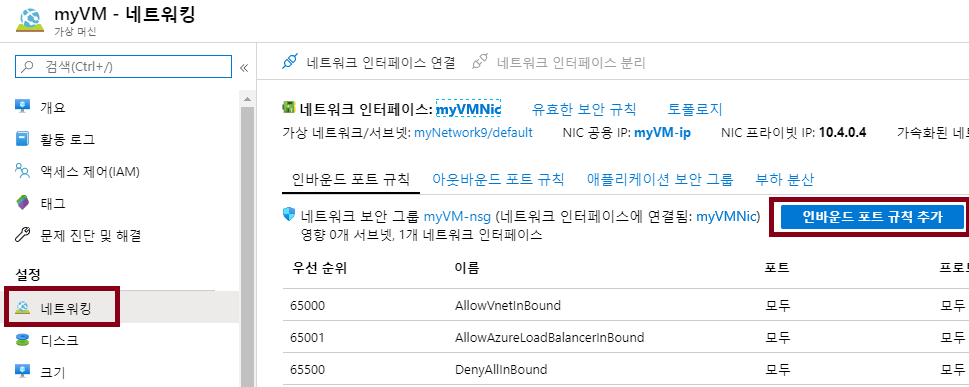

---
wts:
    title: '12 - 네트워크 트래픽 보안'
    module: '모듈 03 - 보안, 개인 정보 보호, 규정 준수 및 신뢰'
---
# 12 - 네트워크 트래픽 보안

이 연습에서는 인바운드 및 아웃바운드 보안 포트 규칙을 만들고 구성합니다.

예상 시간: 45분

# 작업 1: 가상 머신 만들기

이 작업에서는 가상 머신을 만드는 사용자 지정 템플릿을 배포합니다. 

1. [Azure Portal](https://portal.azure.com) 에 로그인합니다.

2. **사용자 지정 템플릿 배포** 를 검색하고 선택합니다.

3. **Windows 가상 머신 만들기** 를 선택합니다.

4. 템플릿을 작성합니다.

    | 설정 | 값 |
    | -- | -- |
    | 구독 | **보유한 구독 선택** |
    | 리소스 그룹 | **myRGSecure**(새로 만들기) |
    | 위치 | **(미국) 미국 동부** |
    | 관리자 사용자 이름 | **azureuser** |
    | 관리 암호 | **Pa$$w0rd1234** |
    | DNS 접두사 | **myrgsecurexxx**(고유해야 함) |
    | Windows OS 버전 | 2016-Datacenter |
    | | |

5. **위의 이용 약관에 동의** 확인란을 선택합니다. 

6. **구매** 를 클릭합니다. 

7. 배포를 모니터링합니다. 리소스 그룹 및 가상 머신을 만드는 데 몇 분 정도 걸릴 수 있습니다. 

8. **알림** 창에서 **리소스로 이동** 을 선택합니다. 

9. **SimpleWinVM** 가상 머신을 선택합니다.

10. **네트워킹** 을 클릭하면 "이 네트워크 인터페이스에 네트워크 보안 그룹이 없습니다"라는 메시지가 표시됩니다.

11. 또한 네트워크 인터페이스의 이름은 **myVMNic** 입니다.

# 작업 2: 네트워크 보안 그룹을 만듭니다.

이 작업에서는 네트워크 보안 그룹을 만들고 네트워크 인터페이스를 연결합니다.

1. 포털에서 **네트워크 보안 그룹** 을 검색하고 선택합니다. 

2. **+추가** 를 클릭하고 양식을 작성합니다.

    | 설정 | 값 |
    | -- | -- |
    | 구독 | **보유한 구독 선택** |
    | 지역 | **(미국) 미국 동부**  |
    | 리소스 그룹 | **myRGSecure**(지역을 설정하기 전까지 사용할 수 없음) |
    | 이름 | **myNSGSecure** |
    | | |

3. **검토 + 만들기** 를 클릭하고 유효성 검사를 수행한 후 **만들기** 를 클릭합니다.

4. NSG가 생성된 후 **리소스로 이동** 합니다.

5. **설정** 에서 **네트워크 인터페이스** 를 클릭하고 **연결** 을 클릭합니다.

6. 새 가상 머신의 네트워크 인터페이스인 **myVMNic** 를 선택합니다. 

# 작업 3: RDP를 허용하는 인바운드 보안 포트 규칙을 구성합니다.

이 작업에서는 인바운드 보안 포트 규칙을 구성하여 가상 머신에 대한 RDP를 허용합니다. 

1. 새 가상 머신을 찾습니다. 

3. **개요** 창에서 **연결** 을 클릭합니다.

4. RDP를 사용하여 가상 머신 연결을 시도합니다. 기본적으로 네트워크 보안 그룹은 RDP를 허용하지 않습니다. 오류 창을 닫습니다. 

    

5. **설정** 에서 **네트워킹** 을 클릭한 다음 **인바운드 포트 규칙 추가** 를 클릭합니다. 부하 분산 장치를 포함하여 가상 네트워크 안의 트래픽을 제외한 모든 인바운드 트래픽을 거부하는 규칙이 있습니다.

    

6. 인바운드 보안 포트 규칙을 검토합니다. 허용된 항목을 보면 포트 3389를 통한 RDP가 나열되지 않은 것을 알 수 있습니다. 

6. **인바운드 포트 규칙 추가** 를 클릭합니다. 완료되면 **추가** 를 클릭합니다. 

    | 설정 | 값 |
    | -- | -- |
    | 소스 | **모두**|
    | 소스 포트 범위 | * |
    | 대상 | **모두** |
    | 대상 포트 범위 | **3389** |
    | 프로토콜 | **TCP** |
    | 작업 | **허용** |
    | 우선 순위 | **300** |
    | 이름 | **RDP 허용** |
    | | |

7. 규칙이 배포될 때까지 기다린 다음 RDP를 가상 머신에 다시 시도합니다. 이번에는 성공해야 합니다. 사용자는 **azureuser** 이고 암호는 **Pa$$w0rd1234** 입니다.

# 작업 4: 인터넷 액세스를 거부하는 아웃바운드 보안 포트 규칙 구성

이 작업에서는 NSG를 만들고 가상 머신에 연결합니다. 그런 다음 인터넷 액세스를 거부하고 규칙이 작동하는지 테스트합니다.

**참고:** 첫 번째 작업에서는 개별 가상 머신에 규칙을 적용했습니다. 이 작업에서는 많은 리소스에 걸쳐 규칙을 적용할 수 있는 NSG를 사용합니다. 

1. 가상 머신 RDP 세션에서 계속합니다. 

2. 머신이 시작되면 **Internet Explorer** 브라우저를 엽니다. 

3. www.bing.com에 액세스할 수 있는지 확인합니다. IE 보안 강화 팝업을 통해 작업해야 합니다. 

**참고:** 이제 아웃바운드 인터넷 액세스를 거부하는 규칙을 구성합니다. 

4. 포털로 돌아가서 가상 머신을 찾습니다.

5. **설정** 에서 **네트워킹** 을 클릭하고 **아웃바운드 포트 규칙** 을 클릭합니다.

6. **AllowInternetOutbound** 라는 규칙이 있습니다. 이 규칙은 기본 규칙이며 제거할 수 없습니다. 

7. **아웃바운드 보안 규칙 추가** 를 클릭하고 인터넷 트래픽을 거부하는 새 아웃바운드 보안 규칙을 더 높은 우선 순위로 구성합니다. 완료되면 **추가** 를 클릭합니다. 

    | 설정 | 값 |
    | -- | -- |
    | 소스 | **모두**|
    | 소스 포트 범위 | * |
    | 대상 | **서비스 태그** |
    | 대상 서비스 태그 | **인터넷** |
    | 대상 포트 범위 | * |
    | 프로토콜 | **TCP** |
    | 작업 | **거부** |
    | 우선 순위 | **4000** |
    | 이름 | **인터넷 거부** |
    | | |

8. RDP 세션으로 돌아갑니다. 

9. www.microsoft.com으로 이동합니다. 페이지가 표시되지 않아야 합니다. 

**참고**: 추가 비용을 방지하려면 이 리소스 그룹을 제거할 수 있습니다. 리소스 그룹을 검색하고 리소스 그룹을 클릭한 다음 **리소스 그룹 삭제** 를 클릭합니다. 리소스 그룹의 이름을 확인한 다음 **삭제** 를 클릭합니다. **알림** 을 모니터링하여 삭제가 어떻게 진행되는지 확인합니다.

