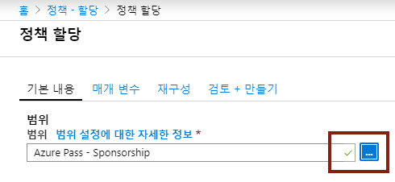
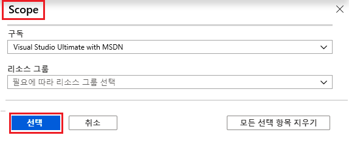
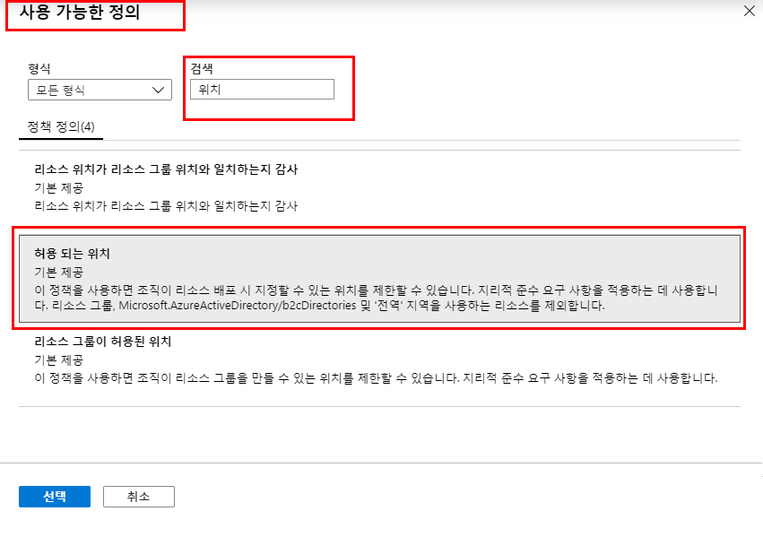
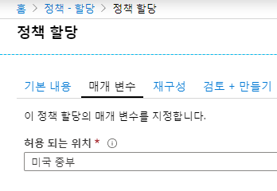
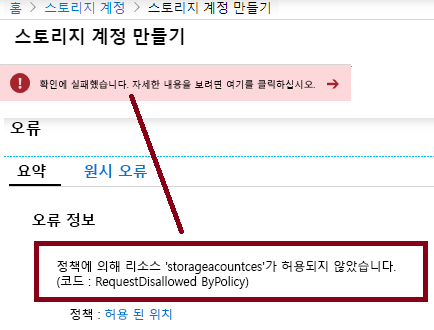
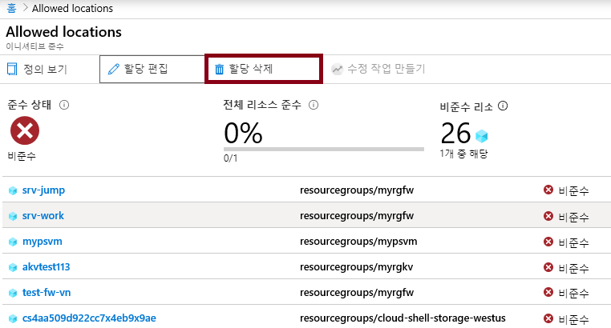

---
wts:
    title: '14 - Azure Policy 만들기'
    module: '모듈 03 - 보안, 개인 정보 보호, 규정 준수 및 신뢰'
---
# 14 - Azure Policy 만들기

이 연습에서는 Azure 리소스의 배포를 특정 위치로 제한하는 Azure Policy를 만듭니다.

예상 시간: 20분

# 작업 1: 정책 할당 만들기

이 작업에서는 허용된 위치 정책을 구성하고 이 정책을 구독에 할당합니다. 

1. [Azure Portal](https://portal.azure.com) 에 로그인합니다.

2. **정책** 을 검색하여 선택하고 **작성** 섹션에서 **정의** 를 클릭합니다.  잠시 동안 기본 제공 정책 정의 목록을 검토합니다. 예를 들어 **범주** 드롭다운에서 **컴퓨팅** 만 선택합니다. **허용된 가상 머신 SKU** 정의를 사용하면 조직에서 배포할 수 있는 가상 머신의 SKU 집합을 지정할 수 있습니다.

3. **정책** 페이지로 돌아가서 **작성** 섹션에서 **할당** 을 클릭합니다. 할당은 특정 범위 내에서 수행할 정책을 할당하는 것입니다. 예를 들어 구독 범위에 정의를 할당할 수 있습니다. 

4. **정책 - 할당** 페이지 상단에서 **정책 할당** 을 선택합니다.

5. **정책 할당** 페이지에서 줄임표를 클릭하여 범위 선택기를 선택합니다.

    

6. 구독이 선택되어 있는지 확인합니다. 사용자의 구독은 다를 수 있습니다. 원하는 경우 정책 범위를 리소스 그룹으로 지정할 수 있습니다. 기본값을 그대로 두고 **선택** 을 클릭합니다. 

    **참고**: 범위는 정책 할당이 적용되는 리소스 또는 리소스 그룹을 결정합니다. 지금 예에서는 특정 리소스 그룹에 이 정책을 할당할 수 있지만 구독 수준에서 정책을 할당하게 됩니다. 또한 범위에 따라 리소스를 제외할 수 있습니다. 제외는 선택 사항입니다.

    

7. **정책 정의** 줄임표 단추를 선택합니다.  **검색** 상자에서 **위치** 를 입력하고 **허용된 위치** 정의를 클릭한 다음 **선택** 을 클릭합니다.

    **참고**: 이 **허용된 위치** 정책 정의는 모든 리소스를 배포해야 하는 위치를 지정합니다. 다른 위치를 선택한 경우 배포가 허용되지 않습니다. 자세한 내용은 [Azure 정책 샘플](https://docs.microsoft.com/ko-kr/azure/governance/policy/samples/index) 페이지를 참조하십시오.

   

8.  **정책 할당** 창의 **매개 변수** 탭에서 **허용된 위치** 상자 끝에 있는 화살표를 클릭하고 후속 목록에서 **일본 서부** 를 선택합니다. 다른 모든 값을 그대로 두고 **검토 + 저장** 을 클릭한 다음 **저장** 합니다.

    

9. 이제 **허용된 위치** 정책 할당이 **정책 - 할당** 창에 나열되고 지정한 범위 수준에서 이 정책 할당을 적용할 수 있습니다.

   

# 작업 2: 허용된 위치 정책 테스트

이 작업에서는 허용된 위치 정책을 테스트합니다. 

1. Azure Portal에서 **스토리지 계정** 을 검색하여 선택하고 **+추가** 를 클릭합니다.

2. 스토리지 계정을 구성합니다. 다른 설정의 경우 기본값을 사용합니다. 

    | 설정 | 값 | 
    | --- | --- |
    | 구독 | **보유한 구독 사용** |
    | 리소스 그룹 | **myRGPolicy**(새로 만들기) |
    | 저장소 계정 이름 | **storageaccountxxx**(고유해야 함) |
    | 위치 | **(미국) 미국 동부** |
    | | |

3. **검토 + 만들기** 를 클릭합니다.

4. 유효성 검사 실패 메시지가 표시됩니다. **세부 정보를 보려면 여기를 클릭** 메시지를 클릭합니다. 결과 **오류** 블레이드의 **요약** 탭에서 오류 메시지 **정책에서 리소스 xyz를 허용하지 않음** 이 표시되고 정책 이름이 **허용된 위치** 로 나열된 것을 확인합니다.

    **참고**: **Raw 오류** 탭을 클릭하여 출력을 보고 허용된 위치 정책을 클릭하여 배포를 차단한 정책을 확인하는 방법으로 보다 자세한 내용을 확인할 수 있습니다.

    

# 작업 3: 정책 할당 삭제

이 작업에서는 허용된 위치 정책 할당을 제거하고 테스트합니다. 

향후 수행하려는 작업이 차단되지 않도록 정책 할당을 삭제합니다.

1. 포털에서 **정책** 을 검색하여 선택한 다음 **허용된 위치** 정책을 클릭합니다.

2. 할당한 다양한 정책의 규정 준수 상태를 볼 수 있습니다.

    **참고**: 허용된 위치 정책에 비준수 리소스가 표시될 수 있습니다. 이 경우 이러한 리소스는 정책 할당 전에 만들어진 리소스입니다.

3. 상단 메뉴에서 **할당 삭제** 를 선택합니다.

   

4. **할당 삭제** 대화 상자에서 **예** 를 클릭하여 정책 삭제를 확인합니다.

5. 다른 스토리지 계정을 만들어 정책이 더 이상 적용되지 않는지 확인합니다.

    **참고**: **허용된 위치** 정책이 유용할 수 있는 몇 가지 시나리오는 다음과 같습니다. 
    - *비용 추적*: 지역 위치에 따라 구독이 다를 수 있으므로 모든 리소스를 해당 지역에 배포하면 비용을 추적하는 데 도움이 됩니다. 
    - *데이터 보존 및 보안 규정 준수*: 또한 데이터 보존 요구 사항이 있는 경우 고객 또는 특정 워크로드별로 구독을 만들고 모든 리소스를 특정 데이터 센터에 배포하도록 정의하면 데이터 및 보안 규정 준수 요구 사항을 준수할 수 있습니다.

축하합니다! Azure 리소스의 배포를 특정 데이터 센터로 제한하는 Azure Policy를 만들었습니다.

**참고**: 추가 비용을 방지하려면 이 리소스 그룹을 제거할 수 있습니다. 리소스 그룹을 검색하고 리소스 그룹을 클릭한 다음 **리소스 그룹 삭제** 를 클릭합니다. 리소스 그룹의 이름을 확인한 다음 **삭제** 를 클릭합니다. **알림** 을 모니터링하여 삭제가 어떻게 진행되는지 확인합니다.