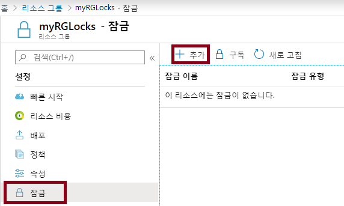
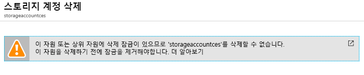

---
wts:
    title: '16 - 리소스 잠금 관리'
    module: '모듈 03 - 보안, 개인 정보 보호, 규정 준수 및 신뢰'
---
# 16 - 리소스 잠금 관리

이 연습에서는 리소스 그룹을 만들고, 리소스 그룹에 잠금을 추가하고, 삭제를 테스트하고, 리소스 그룹의 리소스 삭제를 테스트하고, 리소스 잠금을 제거합니다. 

예상 시간: 15분

# 작업 1: 리소스 그룹 만들기

이 작업에서는 이 연습에 사용할 리소스 그룹을 만듭니다. 

1. [Azure Portal](https://portal.azure.com) 에 로그인합니다.

2. **리소스 그룹** 을 검색하여 선택하고 **+추가** 를 선택합니다.

3. 새 리소스 그룹을 구성합니다. 완료되면 **검토 + 만들기** 를 클릭한 다음 **만들기** 를 클릭합니다. 

    | 설정 | 값 |
    | -- | -- |
    | 구독 | **보유한 구독 사용** |
    | 이름 | **myRGLocks** |
    | 지역 | **(미국) 미국 동부** |
    | | |

# 작업 2:  리소스 그룹에 잠금 추가 및 테스트 삭제

이 작업에서는 리소스 그룹에 리소스 잠금을 추가하고 리소스 그룹 삭제를 테스트합니다. 

1. 새 리소스 그룹인 **myRGLocks** 에 액세스합니다.

2. 구독, 리소스 그룹 또는 개별 리소스에 **잠금** 을 적용하면 조직의 다른 사용자가 중요한 리소스를 실수로 삭제하거나 수정하는 상황을 방지할 수 있습니다. 

3. **설정** 에서 **잠금** 을 클릭한 다음 **+추가** 를 클릭합니다. 

    

4. 새 잠금을 구성합니다. 작업이 완료되면 **확인** 을 클릭합니다. 

    | 설정 | 값 |
    | -- | -- |
    | 잠금 이름 | **RGLock** |
    | 잠금 유형 | **삭제** |
    | | |

5. 리소스 그룹의 **개요** 블레이드를 선택하고 **리소스 그룹 삭제** 를 선택합니다. 리소스 그룹의 이름을 확인하고 **확인** 을 클릭합니다. 리소스 그룹이 잠겨 있고 삭제할 수 없다는 오류 메시지가 나타납니다.

    

# 작업 3: 리소스 그룹의 구성원 테스트 삭제

이 작업에서는 리소스 잠금이 리소스 그룹의 스토리지 계정을 보호하는지 테스트합니다. 

1. **스토리지 계정** 을 검색한 다음 **+추가** 를 클릭합니다. 

2. 스토리지 계정을 구성한 다음 **검토 + 만들기** 를 선택하고 **만들기** 를 클릭합니다.

    | 설정 | 값 | 
    | --- | --- |
    | 구독 | **보유한 구독 선택** |
    | 리소스 그룹 | **myRGLocks** |
    | 저장소 계정 이름 | **storageaccountxxx**(고유해야 함) |
    | 위치 | **(미국) 미국 동부**  |
    | 성능 | **표준** |
    | 계정 종류 | **StorageV2(범용 v2)** |
    | 복제 | **로컬 중복 스토리지 (LRS)** |
    | 액세스 계층 (기본값) | **뜨거운** |
    | | |

3.  스토리지 계정이 성공적으로 생성되었다는 알림을 기다립니다. 

4. 새 스토리지 계정에 액세스하고 **개요** 창에서 **삭제** 를 클릭합니다. 리소스 또는 해당 상위 항목에 삭제 잠금이 설정되었다는 오류 메시지가 표시됩니다. 

    

    **참고**: 스토리지 계정에 특정된 잠금을 만들지는 않았지만 스토리지 계정이 포함된 리소스 그룹 수준에서 잠금을 만들었습니다. 이와 같이 이 *상위* 수준 잠금은 리소스 삭제를 차단하며 스토리지 계정은 상위 항목의 잠금을 상속합니다.

# 작업 4: 리소스 잠금 제거

이 작업에서는 리소스 잠금을 제거하고 테스트합니다. 

1. 리소스 그룹으로 돌아가서 **설정** 에서 **잠금** 을 선택합니다.
    
2. **잠금** 에서 삭제를 선택합니다. 

    

3. 스토리지 계정으로 돌아가서 리소스를 삭제할 수 있는지 확인합니다.

축하합니다! 리소스 그룹을 만들고, 리소스 그룹에 잠금을 추가하고, 삭제를 테스트하고, 리소스 그룹의 리소스 삭제를 테스트하고, 리소스 잠금을 제거했습니다. 

**참고**: 추가 비용을 방지하려면 이 리소스 그룹을 제거할 수 있습니다. 리소스 그룹을 검색하고 리소스 그룹을 클릭한 다음 **리소스 그룹 삭제** 를 클릭합니다. 리소스 그룹의 이름을 확인한 다음 **삭제** 를 클릭합니다. **알림** 을 모니터링하여 삭제가 어떻게 진행되는지 확인합니다.