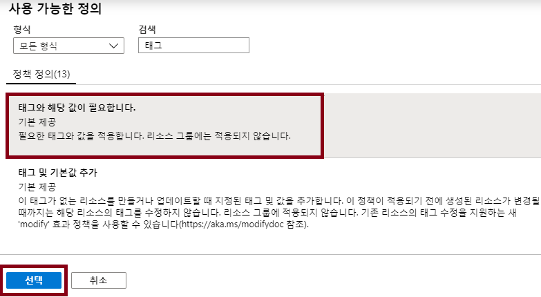
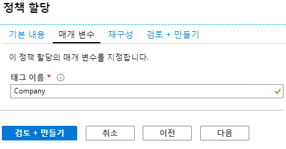
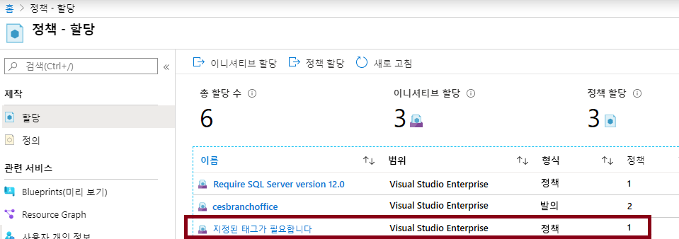
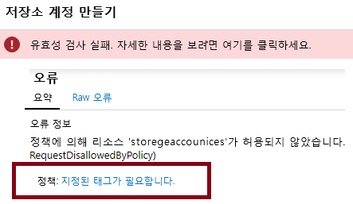
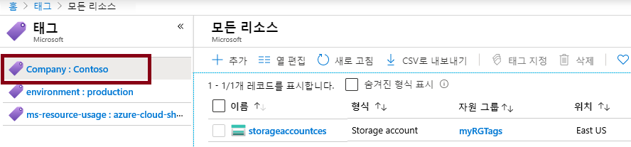
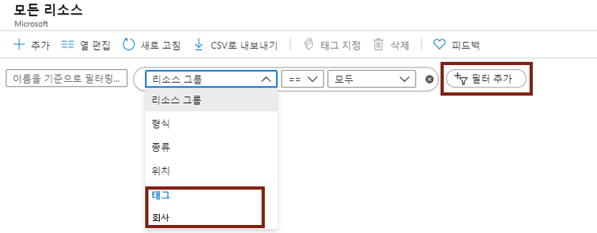

---
wts:
    title: '17 - 리소스 태그 지정 구현'
    module: '모듈 03 - 보안, 개인 정보 보호, 규정 준수 및 신뢰'
---
# 17 - 리소스 태그 지정 구현

이 연습에서는 태그 지정을 요구하는 정책 할당을 만들고, 스토리지 계정을 만들고, 태그를 테스트하고, 지정된 태그가 있는 리소스를 보고, 태그 지정 정책을 제거합니다.

예상 시간: 30분

# 작업 1: 정책 할당 만들기

이 작업에서는 **특정 태그 필요** 정책을 구성하고 이 정책을 구독에 할당합니다. 

1. [Azure Portal](https://portal.azure.com) 에 로그인합니다.

2. **정책** 을 검색하고 선택합니다. 

3. **작성** 섹션에서 **할당** 을 클릭하고 페이지 상단에서 **정책 할당** 을 선택합니다.

4. 정책의 **범위** 는 구독 전체입니다. 

5. **정책 정의** 줄임표 단추(오른쪽 텍스트 상자의 끝)를 선택합니다.  **검색** 상자에서 **태그** 를 입력하고 **지정된 태그 필요** 정의를 클릭한 다음 **선택** 을 클릭합니다.

   

6.  **정책 할당** 창의 **매개 변수** 탭에서 태그 이름으로 **Company** 를 입력합니다. **검토 + 만들기** 를 클릭하고 **만들기** 를 클릭합니다.

    **참고:** 다음은 태그 지정을 보여주는 간단한 예제입니다. 

    

7. **지정된 태그 필요** 정책 할당이 만들어졌습니다. 구독 리소스를 만들 때 Company 태그 값을 제공해야 합니다.

   

# 작업 2: 스토리지 계정을 만들어 필요한 태그 지정 테스트

이 작업에서는 스토리지 계정을 만들어 필요한 태그 지정을 테스트합니다. 

1. Azure Portal에서 **스토리지 계정** 을 검색하여 선택하고 **+추가** 를 클릭합니다.

2. 스토리지 계정을 구성합니다. 

    | 설정 | 값 | 
    | --- | --- |
    | 구독 | **보유한 구독 사용** |
    | 리소스 그룹 | **myRGTags**(새로 만들기) |
    | 저장소 계정 이름 | **storageaccountxxx**(고유해야 함) |
    | 위치 | **(미국) 미국 동부** |
    | | |

3. **검토 + 만들기** 를 클릭합니다. 

**참고:** 태그를 제공하지 않는 경우의 결과를 확인하기 위한 테스트를 수행하고 있습니다. 

4. 유효성 검사 실패 메시지가 표시됩니다. **세부 정보를 보려면 여기를 클릭** 메시지를 클릭합니다. 결과 **오류** 블레이드의 **요약** 탭에 오류 메시지 **정책에서 리소스를 허용하지 않음** 이 표시됩니다.

    **참고:** Raw 오류 탭에는 필요한 특정 태그 이름이 표시됩니다. 

    

5. **오류** 창을 닫고 **이전**(화면 아래쪽)을 클릭합니다. 태그 지정 정보를 제공합니다. 

    | 설정 | 값 | 
    | --- | --- |
    | 태그 이름 | **Company**(드롭다운 목록에 없을 수 있음) |
    | 태그 값 | **Contoso** |
    | | |

6. **검토 + 만들기** 를 클릭합니다. 이제 유효성 검사에 통과해야 합니다. **만들기** 를 클릭하여 스토리지 계정을 배포합니다. 

# 작업 3: 특정 태그가 있는 모든 리소스 보기

1. 포털에서 **태그** 를 검색하고 선택합니다.

2. 사용 가능한 모든 태그/값이 표시됩니다. **Company:Contoso** 쌍을 선택하면 스토리지 계정이 나열됩니다. 태그를 표시하려면 스토리지 계정을 배포해야 합니다. 

   

3. 포털에서 **모든 리소스** 를 검색하고 선택합니다.

4. **필터 추가** 를 클릭하고 **Company** 태그를 추가합니다. 사용 가능한 태그 값으로 검색을 제한할 수 있습니다. 적용된 필터와 함께 스토리지 계정이 나열됩니다.

    

# 작업 4: 정책 할당 삭제

이 작업에서는 향후 작업에 영향을 주지 않도록 **특정 태그 필요** 정책을 제거합니다. 

1. 포털에서 **정책** 을 검색하여 선택한 다음 **지정된 태그 필요** 정책을 클릭합니다.

2. 상단 메뉴에서 **할당 삭제** 를 선택합니다.

3. **할당 삭제** 대화 상자에서 **예** 를 클릭하여 정책 삭제를 확인합니다.

5. 시간이 있으면 다른 리소스를 만들어 정책이 더 이상 적용되지 않는지 확인합니다.

이 연습에서는 태그 지정을 요구하는 정책 할당을 만들고, 스토리지 계정을 만들고, 태그를 테스트하고, 지정된 태그가 있는 리소스를 보고, 태그 지정 정책을 제거했습니다.

**참고**: 추가 비용을 방지하려면 이 리소스 그룹을 제거할 수 있습니다. 리소스 그룹을 검색하고 리소스 그룹을 클릭한 다음 **리소스 그룹 삭제** 를 클릭합니다. 리소스 그룹의 이름을 확인한 다음 **삭제** 를 클릭합니다. **알림** 을 모니터링하여 삭제가 어떻게 진행되는지 확인합니다.