---
wts:
    title: '19 - Azure 가격 계산기 사용'
    module: '모듈 04 - Azure 가격 책정 및 지원'
---
# 19 - 가격 계산기 사용

이 연습에서는 Azure 가격 계산기를 사용하여 Azure 가상 머신 및 관련 네트워크 리소스에 대한 예상 비용을 생성합니다.

예상 시간: 30분

# 작업 1: 가격 계산기 구성

이 작업에서는 Azure 가격 계산기에서 간단한 인프라를 구성합니다. 

**참고**: Azure 가격 계산기 예상액을 만들기 위해 이 연습에서는 VM 및 관련 리소스에 대한 예제 구성을 제공합니다. 예제 구성을 사용하거나 Azure 가격 계산기에 *실제* 리소스 요구 사항에 대한 세부 정보를 대신 제공합니다.

1. 브라우저에서 [Azure 가격 계산기](https://azure.microsoft.com/ko-kr/pricing/calculator/) 웹 페이지로 이동합니다.

2. VM 구성에 대한 세부 정보를 추가하려면 **제품** 탭에서 **가상 머신** 을 선택합니다. 아래로 스크롤하여 가상 머신 세부 정보를 봅니다. 

3. Azure 가격 계산기 견적의 이름과 VM 구성의 이름을 입력합니다. 이 연습 예제에서는 **예상값에 대한 내 가격 계산기 견적** 및 VM 구성을 위해 **Windows VM을** 사용합니다.

   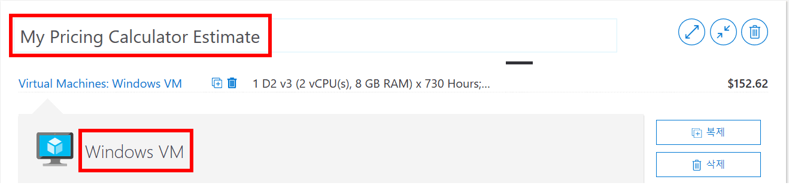

4. 기본 VM 구성을 수정합니다.

    |지역|운영 체제|입력|
    |------|----------------|----|
    |북유럽|Windows|(OS 전용)|
    | | |

    |계층|인스턴스|
    |----|--------|
    |표준|A2: 2 코어, 3.5 GB RAM, 135 GB 임시 저장소|
    | | |

   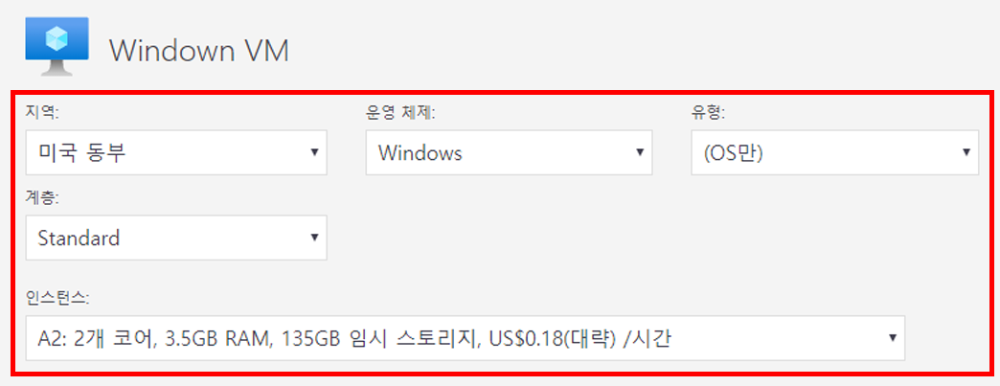

    **참고**: VM 인스턴스 사양 및 가격은 이 예제의 사양과 다를 수 있습니다. 예제와 가능한 한 가깝게 일치하는 인스턴스를 선택하여 이 연습에 따릅니다. 다양한 VM 제품 옵션에 대한 세부 정보를 보려면 오른쪽의 **추가 정보** 메뉴에서 **제품 세부 정보** 를 선택합니다.

5. **결제 옵션을** **종량제로 설정합니다**.

   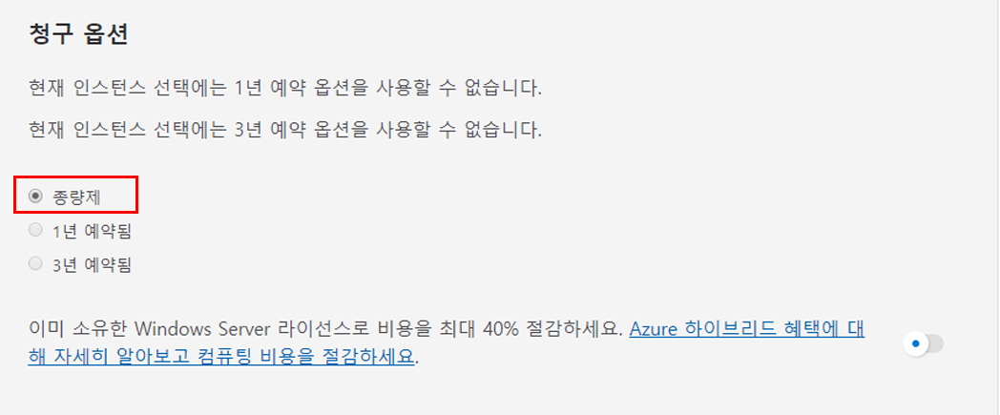

6. Azure에서 한 달은 730시간으로 정의됩니다. 매월 VM을 100% 사용할 수 있도록 해야하는 경우 월별 시간 값을 `730`으로 설정합니다. 이 연습 예제에서는 한 VM을 매월 50%의 시간을 사용할 수 있도록 합니다.

    VM 수를 `1`로 설정하고 월별 시간 값을 `365`로 변경합니다.

   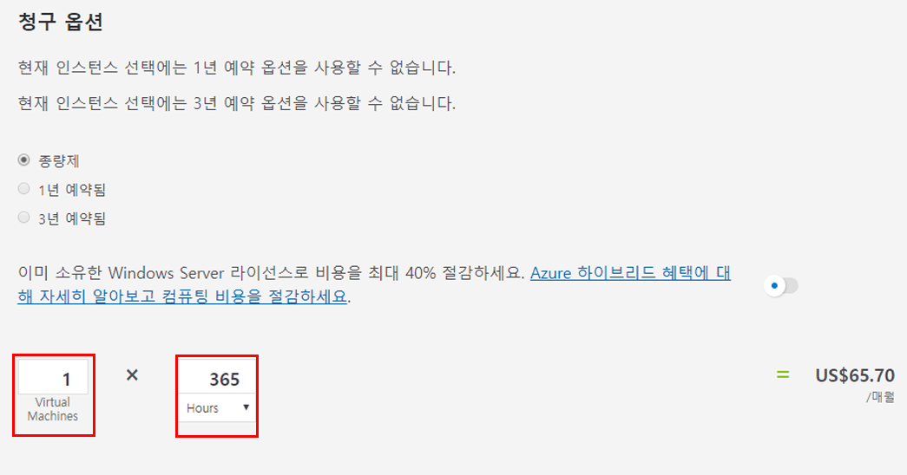

7. **관리 OS 디스크** 창에서 기본 VM스토리지 구성을 수정합니다.

    |계층|디스크 크기|디스크 수|스냅숏|스토리지 트랜잭션|
    |----|---------|---------------|--------|--------------------|
    |표준 HDD|S30: 1024 GiB|1|꺼짐|10,000|

   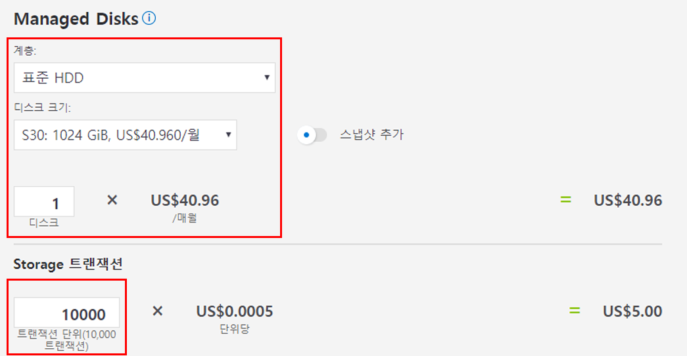

8. 견적에 네트워킹 대역폭을 추가하려면 Azure 가격 계산기 웹 페이지의 상단으로 이동하십시오. **왼쪽의 제품** 메뉴에서 **네트워킹을** 선택한 다음 대역폭 타일을 선택합니다. **대역폭 추가됨** 메시지 대화 상자에서 **보기** 를 선택합니다.

   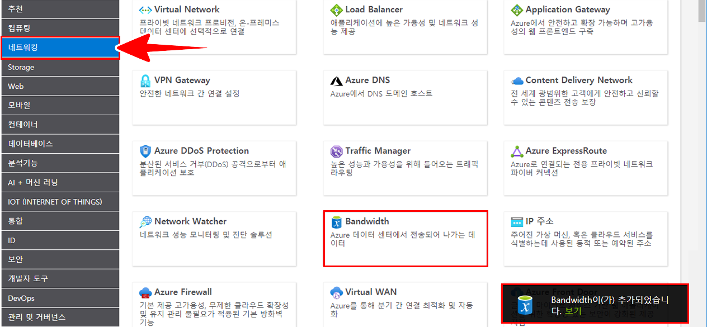

9. VM 대역폭 구성에 대한 이름을 추가합니다. 이 연습 예제에서는 **대역폭이라는** 이름을 사용합니다:**Windows VM**. 다음 세부 정보를 추가하여 기본 대역폭 구성을 수정합니다.

    |지역|영역 1 아웃바운드 데이터 전송 양|
    |------|--------------------------------------|
    |북유럽|50 GB|

   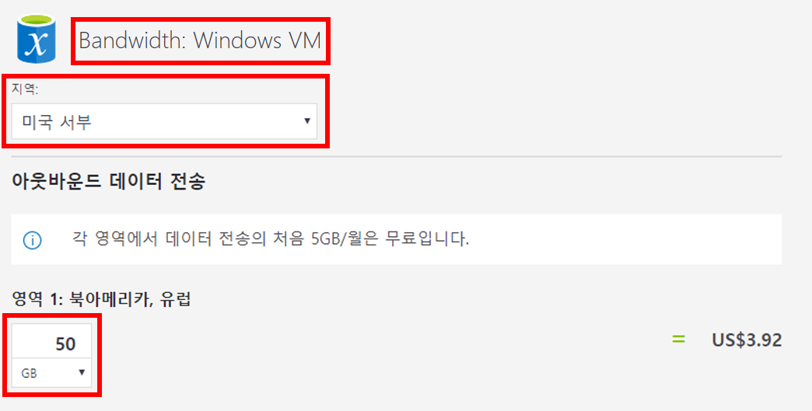

10. Application Gateway를 추가하려면 Azure 가격 계산기 웹 페이지의 맨 위로 돌아갑니다. **네트워킹** 제품 메뉴에서 **Application Gateway** 타일을 선택합니다. **Application Gateway** 메시지 대화 상자 내에서 **보기** 를 선택합니다.

    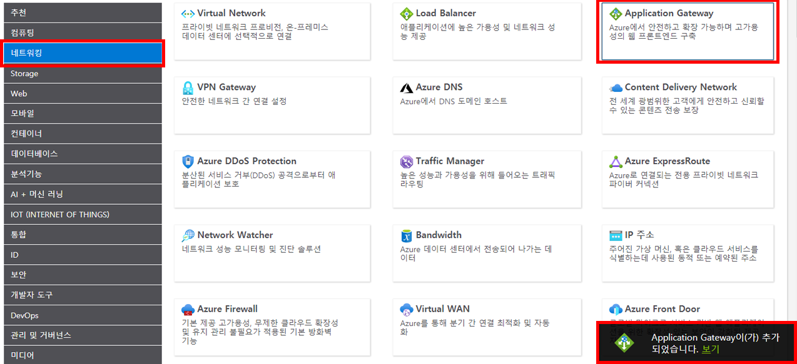

11. Application Gateway 구성에 대한 이름을 추가합니다. 이 연습에서는 **App Gateway: Windows VM** 이라는 이름을 사용합니다. 다음 세부 정보를 추가하여 기본 Application Gateway 구성을 수정합니다.

    |지역|계층|크기|
    |------|----|----|
    |북유럽|기본|Small|
    | | |

    |인스턴스|시간|
    |-------|-------|
    |1|365|
    | | |

    |처리된 데이터|
    |--------------|
    |50 GB|
    | | |

    |영역 1: 북미, 유럽|
    |-----------------------------|
    |50 GB|
    | | |

    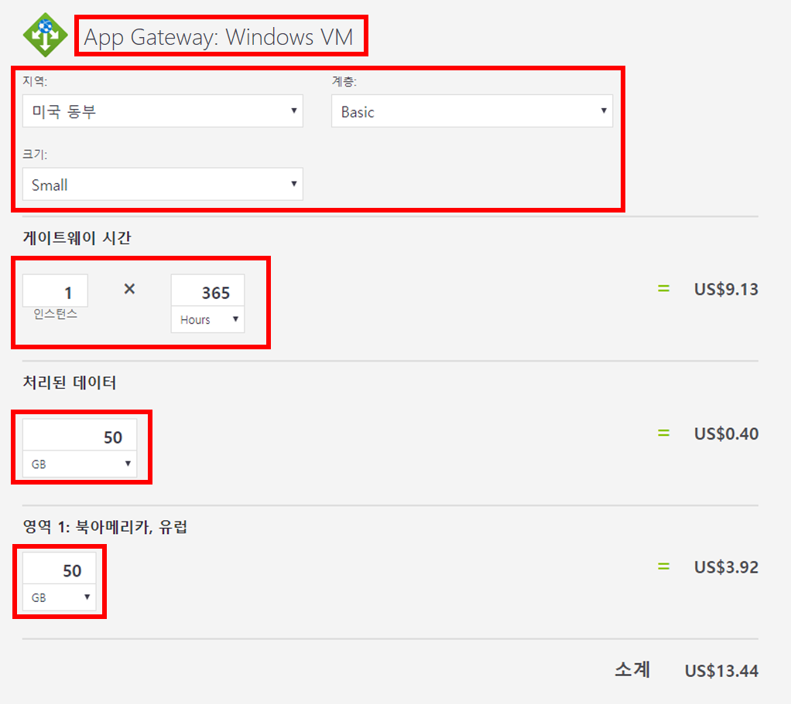

# 작업 2: 예상 가격 검토

이 작업에서는 Azure 가격 계산기의 결과를 검토합니다. 

1. Azure 가격 계산기 웹 페이지의 하단으로 스크롤하여 **총 예상 월별 비용** 을 확인합니다.

    **참고**: Azure 가격 계산기에서 사용할 수 있는 다양한 옵션을 살펴봅니다. 예를 들어 이 연습에서는 통화를 유로로 업데이트해야 합니다.

2. 통화를 유로로 변경한 다음 **내보내기** 를 선택하여 Microsoft Excel (`.xlsx`) 형식으로 오프라인으로 볼 수 있는 견적의 복사본을 다운로드합니다.

    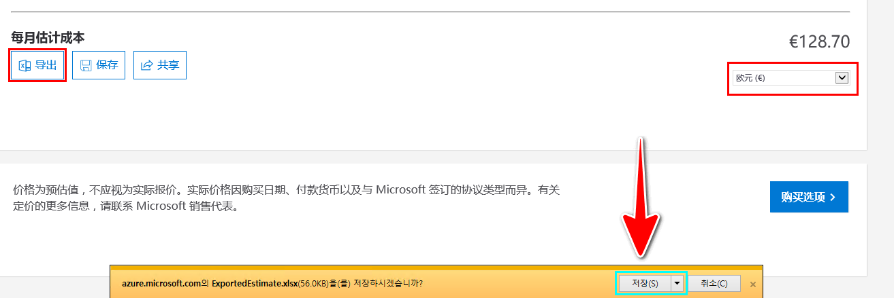

    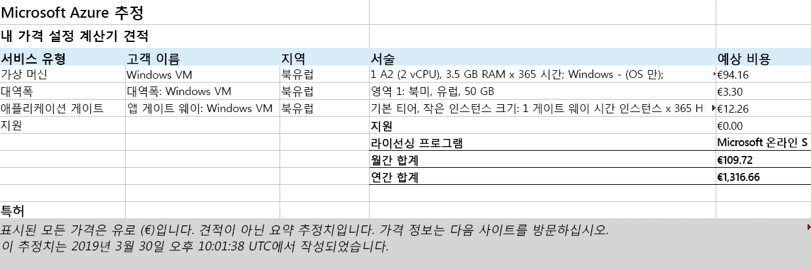

축하합니다! Azure 가격 계산기에서 견적을 다운로드했습니다.
