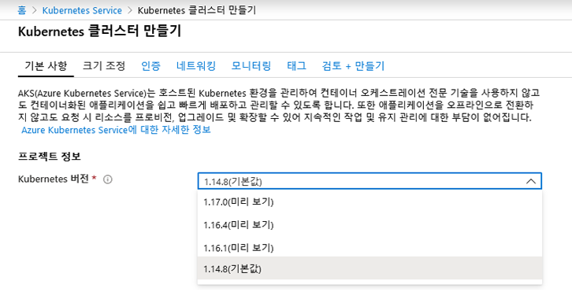
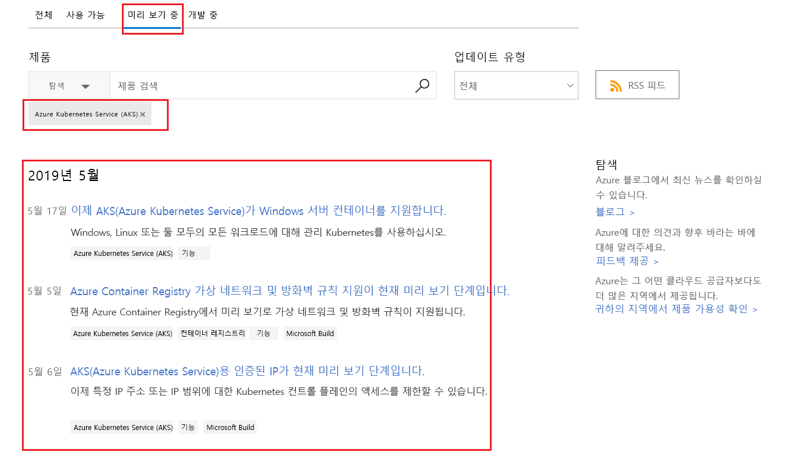

---
wts:
    title: '23 - Azure 미리 보기 기능 액세스'
    module: '모듈 04 - Azure 가격 책정 및 지원'
---

# 23 - Azure 미리 보기 기능 액세스

이 연습에서는 Azure 미리 보기 서비스 및 기능에 액세스하여 이러한 서비스 및 기능을 식별하고 최신 Azure 업데이트 정보를 봅니다.

예상 시간: 10분

# 작업 1: 미리 보기 서비스 및 기능에 액세스

이 작업에서는 Marketplace 미리 보기 기능을 검토합니다. 

1. [Azure Portal](https://portal.azure.com) 에 로그인합니다.

2. **Marketplace** 를 검색하고 선택합니다. 

3. Marketplace에서 **미리 보기** 를 검색합니다. 관심 있는 미리 보기 제품을 검토합니다. 

4. Marketplace에서 **Kubernetes Service** 를 검색합니다. Kubernetes Service를 선택하고 **만들기** 를 클릭합니다.

5. **Kubernetes 버전** 드롭다운에 **미리 보기** 버전이 표시됩니다. 모든 서비스에 미리 보기 버전이 있는 것은 아닙니다. 

    

    **참고**: 기존의 정식 출시된 Azure 서비스 또는 제품 내에서 새로운 기능이 제공되는 시나리오에서는 프로덕션에서 Azure 서비스를 사용할 수 있지만 미리 보기 기능은 프로덕션 배포용으로 준비되지 않았을 수 있습니다. 또한 프로덕션에 배포하기 전에 사용과 관련된 제한 사항을 숙지해야 합니다.

# 작업 2: Azure 업데이트 페이지 검토

이 작업에서는 Azure 업데이트 페이지를 검토합니다.

1. 브라우저에서 [Azure 업데이트](https://azure.microsoft.com/ko-kr/updates/) 페이지로 이동합니다. 

2. **모두**, **사용 가능**, **미리 보기** 및 **개발 중** 의 4가지 탭 옵션이 있습니다.

3. **미리 보기** 탭을 클릭하고 검색 상자에 **Kubernetes** 를 입력한 다음 메시지가 표시되면 AKS(Azure Kubernetes Service)를 선택합니다. 이 페이지는 Kubernetes와 관련된 미리 보기 항목의 목록을 반환합니다. 실제 결과 목록은 다를 수 있습니다. 

    

4. 자세한 정보를 보려면 결과 목록의 항목을 클릭합니다. 

5. **Azure 업데이트** 페이지로 돌아가서 **사용 가능** 을 클릭하고 표시되는 항목을 확인하여 **정식 출시** 상태의 항목을 봅니다. 관심 있는 모든 항목을 찾아봅니다.

6. **Azure 업데이트** 페이지로 돌아가서 **개발 중** 탭을 클릭하고 현재 개발 중인 항목을 확인합니다. 관심 있는 모든 항목을 찾아봅니다.

축하합니다! Azure 미리 보기 서비스 및 기능에 액세스하여 이러한 서비스 및 기능을 식별하고 최신 Azure 업데이트 정보를 확인했습니다.

